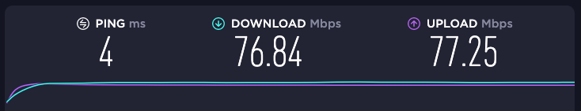

# Интернет бывает разный

Все больше интернет-пользователей потребляет контент с мобильных устройств. Но мобильное устройство особенное не 
только потому что оно компактное и имеет меньший размер экрана, но еще и потому, что мобильное устройство может 
быть подключено к Интернет через сотовую связь. Не везде и не у всех всегда доступен 5G, качество связи даже в 
крупном развитом мегаполисе может меняться — отдаленный район со слабым покрытием, или наоборот центральный 
с большим количеством активных клиентов, метро или железобетонный дом — все это влияет на качество связи.

А что такое это "качество связи"? Обычно говорят о двух параметрах — пропускная способность канала (она же bandwidth) 
и задержки (latency).

Пропускная способность канала, это по сути скорость соединения — сколько байт (килобайт, мегабайт)
в секунду может доставить сеть к потребителю или от него.

Задержка (или время ожидания) - это время, которое требуется, для того, чтобы доставить пакет данных между источником 
и получателем.

Перед вами два замера, сделанные с помощью утилиты Speedtest в одно и то же время в одной и той же географической 
локации. Один замер — проводное подключение, второй — мобильное. Обратите внимание — несмотря на то что 
LTE дал скорость, сравнимую с проводным интернетом, на мобильной сети задержка (см. Ping) в 10 раз выше!

Зачем это знать? Все дело в том, что чем хуже у пользователя качество связи (по любому из параметров), 
тем медленнее будут загружаться данные с вашего сайта. А как мы выяснили, первая стадия отрисовки страницы 
это загрузка ее содержимого!

Безусловно, повлиять на качество связи пользователя мы не можем. А вот на свойства нашего сайта и его 
содержимого — вполне. Что мы можем сделать и как — рассмотрим далее.