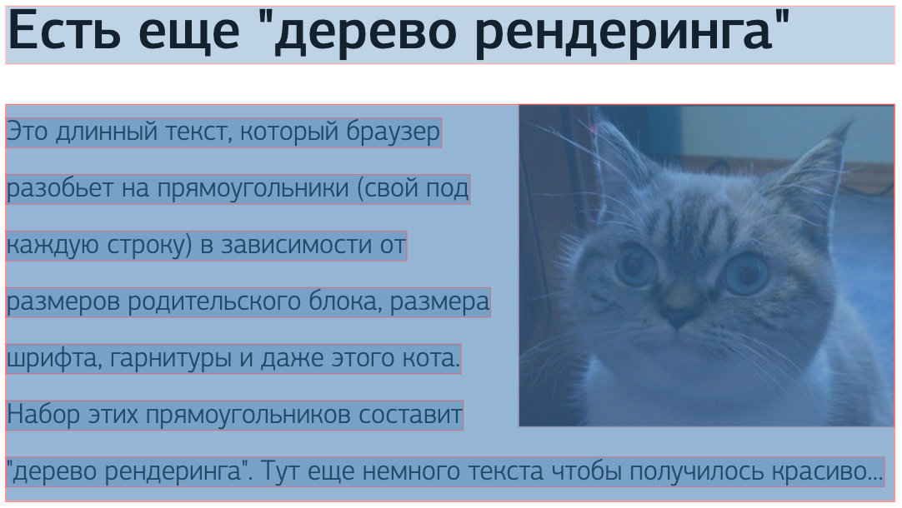

# Что браузеру нужно знать, чтобы нарисовать страницу?

## Разметка
Как мы уже разобрались выше, страница начинается с HTML-разметки. 
Браузер запрашивает по сети либо с диска байты данных файла с разметкой, 
преобразует их в текст с учетом кодировки. Затем текст разбивается на токены в соответствии 
со стандартом разметки — выделяем элементы в угловых скобках, разбираем атрибуты и их значения. 
Из токенов конструируем узлы дерева, а затем и все дерево документа целиком.

В результате получаем Объектную Модель Документа (Document Object Model, DOM) которую браузер использует для дальнейшей 
отрисовки, а разработчик использует для анализа документа и его модификации.

## Оформление

Для вывода документа на экран одной только разметки недостаточно. Браузеру потребуются стили. 
Как правило, стили подключаются из внешнего файла с помощью соответствующей конструкции.
Раз файл внешний, нам так же, как и в случае HTML-разметки, нужно загрузить байты данных файла со стилями, 
преобразовать их в текст, затем разобрать на токены и построить дерево стилей.
Стилевая информация так же как и разметка — структура древовидная, т.к. стили определенные на уровне выше 
(например цвет, размер шрифта) распространяются и на дочерние узлы.

На выходе мы получаем CSSOM, CSS Object Model - Объектную Модель Каскадной Таблицы Стилей

## Подготовка к отрисовке. Дерево рендеринга

Далее, браузеру требуется совместить DOM и CSSOM что бы решить, какие элементы будут отображаться на экране, а какие \
нет, а также какие именно стили будут применяться к каждому элементу DOM-дерева. 
Результат этой работы — дерево рендеринга.

Какие-то элементы DOM-дерева не отображаются в принципе (например &lt;head&gt;, &lt;meta&gt; или &lt;script&gt;),
какие-то могут быть скрыты по причине наложенных стилей (в примере выше разработчик решил не отображать на экране все 
теги &lt;span&gt; находящиеся внутри тегов &lt;p&gt;).

## Раскладка (Layout)

После того как дерево рендеринга построено и браузер знает, какие стили соответствуют элементам дерева, 
требуется подготовить раскладку элементов по видимой области.
На расположение элемента на странице влияет множество параметров: размер самой страницы, размер элемента, 
шрифт, которым набран текст внутри элемента и его размер. 
Мало того, на раскладку зависит взаимное расположение элементов на странице и даже конкретное 
текстовое содержимое — ведь текст, если он не влезает, надо перенести на другую строку по правилам!

## Подытожим
Для того чтобы нарисовать страницу, браузер должен:
  1. Загрузить разметку и построить по ней DOM
  1. Загрузить оформление и построить по нему CSSOM
  1. Построить по DOM+CSSOM дерево рендеринга
  1. Загрузить прочие необходимые ресурсы, например шрифты и изображения
  1. Используя дерево рендеринга подготовить раскладку элементов по странице
  1. После этих шагов можно приступить к отрисовке.
