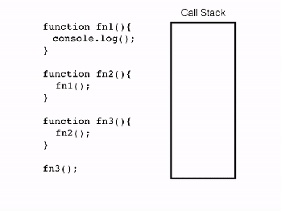

# Как JavaScript работает с синхронным кодом

Чтобы понять как JavaScript работает с синхронным кодом, нам нужно знать что такое ***стек вызовов***.

Под стеком вызовов подразумевается стек со структурой *LIFO*
(Last In, First Out / Последний вошел, первый вышел), который используется для хранения всех контекстов выполнения, созданных на протяжении исполнения кода. И, т.к. JavaScript - однопоточный язык программирования, - это означает, что имеется только один стек вызовов, а элементы могут добавляться и удаляться только с вершины этого стека.

Теперь давайте взглянем на следующий код для примера:

```javascript
    function fn1() {
        console.log();
    }

    function fn2() {
        fn1();
    }

    function fn3() {
        fn2();
    }

    fn3();
```

И посмотрим как JavaScript будет с ним работать.
`(Пример кода под картинку с интерента. Можно привлечь дизайнеров и сделать свой пример)`



Когда код начал выполняться, был создан глобальный контекст выполнения (представленный как main()) и добавлен на вершину стека вызовов.

Когда встречается вызов функции fn3(), он добавляется на вершину стека.  
Далее идет вызов функции fn2(), он помещается на вершину стека.  
Затем идет вызов fn1(), он помещается на вершину стека.  
Следующим, на вершину стека вызовов помещается console.log(), после выполнения он удаляется из стека.  
Затем функция fn1() завершена и удаляется из стека.  
Тоже самое происходит и с fn2(), затем fn3().

Выполнение программы заканчивается, поэтому глобальный контекст вызова (main()) удаляется из стека.