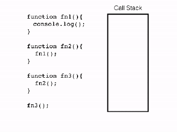

# Асинхронность в JS

JavaScript - ***однопоточный язык программирования***, в котором может быть выполнено только что-то одно за раз. То есть, в одном потоке движок JavaScript может обработать только 1 оператор за раз.

Если какая-либо операция выполняется продолжительное время, вся программа остановит выполнение и будет ожидать ее завершения. Пока это происходит, вы не сможете взаимодействовать со страницей, будет ощущение, что вкладка зависла. Это называется ***блокированием потока***. 

Рассмотрим следующие примеры:
*       let i = 0;
        const start = Date.now();
        function increment() {
            for (let j = 0; j < 5e9; j++) {
                i++;
            }
            alert(`Выполнено за ${(Date.now() - start) / 1000} секунд`);
        }
        increment();

*       const start = Date.now();
        let xhr = new XMLHttpRequest();
        xhr.open('GET', '/long-responce', false);
        try {
            xhr.send();
            if (xhr.status != 200) {
                alert('Ошибка');
            } else {
            alert(`Выполнено за ${(Date.now() - start) / 1000} секунд`);
            }
        } catch(err) {
            alert("Запрос не удался");
        }

Если запустить эти 2 блока кода, произойдет блокирование потока.  Давайте разберемся, почему так происходит и как можно этого избежать.

## Как JavaScript работает с синхронным кодом
Чтобы понять как JavaScript работает с синхронным кодом, нам нужно знать что такое ***стек вызовов***.

Под стеком вызовов подразумевается стек со структурой *LIFO*
(Last in, First Out / Последний вошел, первый вышел), который используется для хранения всех контекстов выполнения, созданных на протяжении исполнения кода. И, т.к. JavaScript - однопоточный язык программирования, - это означает, что имеется только один стек вызовов, а элементы могут добавляться и удаляться только с вершины этого стека.

Теперь давайте взглянем на следующий код для примера:

        function fn1() {
            console.log();
        }

        function fn2() {
            fn1();
        }

        function fn3() {
            fn2();
        }

        fn3();

И посмотрим как JavaScript будет с ним работать.
`(Пример кода под картинку с интерента. Можно привлечь дизайнеров и сделать свои)`

Когда код начал выполняться, был создан глобальный контекст выполнения (представленный как main()) и добавлен на вершину стека вызовов.

Когда встречается вызов функции fn3(), он так же добавляется на вершину стека. Далее идет вызов функции fn2(), она помещается на вершину стека. Далее идет вызов fn1(), он помещается на вершину стека. Далее, на вершину стека вызовов помещается console.log(), после выполнения он удаляется из стека. Затем функция fn1() завершена и удаляется из стека. Тоже самое происходит и с fn2(), затем fn1().

Выполнение программы заканчивается, поэтому глобальный контекст вызова (main()) удаляется из стека.

## Как JavaScript работает с асинхронным кодом
Чтобы понять как JavaScript работает с асинхронным кодом, нам нужно знать что такое ***цикл событий или Event Loop***.

Алгоритм работы цикла событий:
1. Выполнить первую в очереди задачу из очереди микрозадач
    * делать это пока очередь не будет пуста (в процессе выполнения микро задач, очередь может пополняться)
2. Выполнить перерендер страницы при необходимости.
3. Выполнить первую в очереди задачу из очереди микрозадач
    * при отсутствии задач в очереди пропустить шаг
4. Повторить цикл

`Асинхронность в JavaScript – это не встроенная возможность языка, а API, которое предоставляется средой выполнения (Браузер, Node.js).`

`(Хочется сделать пример кода с гифкой как в примере выше, нужны дизайнеры)`

        console.log('start');

        setTimeout(function timeOutCallback() {
            console.log('timeout callback');
        });

        const pr = new Promise(function promiseConstr(res) {
            console.log('promise constructor');
            res();
        });

        pr.then(function promiseCallback() {
            consoe.log('promise callback');
        });

        console.log('end');

Когда код начал выполняться, был создан глобальный контекст выполнения (представленный как main()) и добавлен на вершину стека вызовов. Далее, на вершину стека вызовов помещается console.log('start'), после выполнения он удаляется из стека.

Следующая вызывается функция setTimeout() и помещается на вершину стека. setTimeout() запускает таймер на указанное время и с помощью web API, помещает timeOutCallback в очередь макрозадач.

На этом этапе, setTimeout() завершается и удаляется из стека. После этого, в стек добавляется конструктор промиса. Далее, на вершину стека вызовов помещается console.log('promise constructor'), после выполнения он удаляется из стека. Тоже самое с происходит с вызовом res().

Затем встречается вызов обработчика промиса .then(). Он помещается на вершину стека вызовов, выполняется и добавляет promiseCallback в очередь микрозадач.

Далее, на вершину стека вызовов помещается console.log('end'), после выполнения он удаляется из стека.

Выполнение заканчивается, поэтому глобальный контекст вызова (main()) удаляется из стека.

Далее в ход вступает Event Loop.

В очереди микрозадач есть задача и промис, на который был повешен этот обработчик, разрешился.
Создается глобальный контекст выполнения (представленный как main()) и добавляется на вершину стека вызовов. Далее promiseCallback() помещается на вершину стека вызовов. Далее, на вершину стека вызовов помещается console.log('promise callback'), после выполнения он удаляется из стека. Затем функция promiseCallback() завершена и удаляется из стека. Выполнение заканчивается, поэтому глобальный контекст вызова (main()) удаляется из стека.

Смотрим снова в очередь микрозадач. Она пуста. Переходим к следующему шагу. Перерисовка страницы не требуется. Переходим к следующем шагу.

В очереди макрозадач есть задача. Таймер установленный на таймауте истек. Создается глобальный контекст выполнения (представленный как main()) и добавляется на вершину стека вызовов. 
Далее timeOutCallback() помещается на вершину стека вызовов. Далее, на вершину стека вызовов помещается console.log('timeout callback'), после выполнения он удаляется из стека. Затем функция timeOutCallback() завершена и удаляется из стека. Выполнение заканчивается, поэтому глобальный контекст вызова (main()) удаляется из стека.