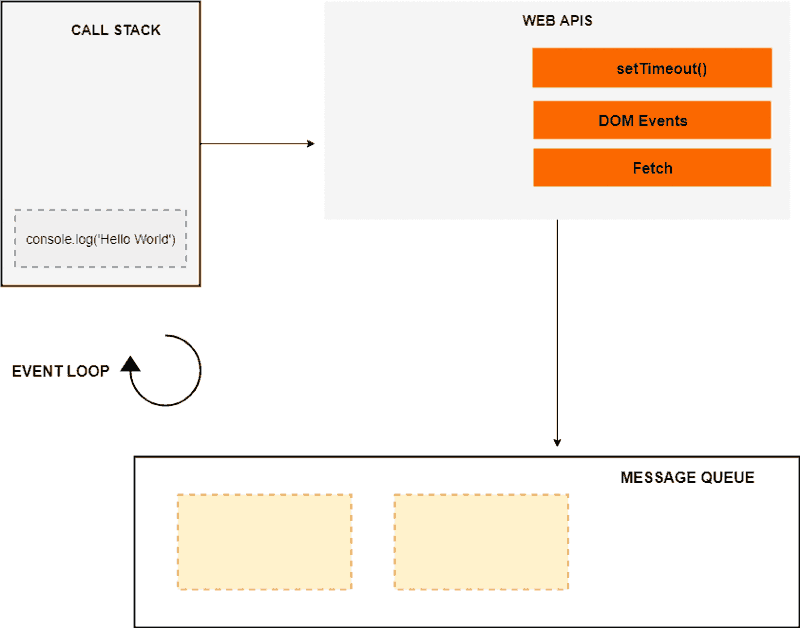

# Асинхронность в JS

JavaScript - ***однопоточный язык программирования***, в котором может быть выполнено только что-то одно за раз. То есть, в одном потоке движок JavaScript может обработать только 1 оператор за раз.

Если какая-либо операция выполняется продолжительное время, вся программа остановит выполнение и будет ожидать ее завершения. Пока это происходит, вы не сможете взаимодействовать со страницей, будет ощущение, что вкладка зависла. Это называется ***блокированием потока***. 

Рассмотрим следующие примеры:
* ```javascript
    let i = 0;
    const start = Date.now();
    function increment() {
        for (let j = 0; j < 1e9; j++) {
            i++;
        }
        return `Выполнено за ${(Date.now() - start) / 1000} секунд`;
    }
    console.log(increment());
    ```

* ```javascript
    const start = Date.now();
    let xhr = new XMLHttpRequest();
    xhr.open('GET', '/long-responce', false);
    try {
        xhr.send();
        if (xhr.status != 200) {
            alert('Ошибка');
        } else {
            alert(`Выполнено за ${(Date.now() - start) / 1000} секунд`);
        }
    } catch(err) {
        alert("Запрос не удался");
    }
    ```

Если запустить эти 2 блока кода, произойдет блокирование потока. Давайте разберемся, почему так происходит и как можно этого избежать.

## Как JavaScript работает с синхронным кодом
Чтобы понять как JavaScript работает с синхронным кодом, нам нужно знать что такое ***стек вызовов***.

Под стеком вызовов подразумевается стек со структурой *LIFO*
(Last in, First Out / Последний вошел, первый вышел), который используется для хранения всех контекстов выполнения, созданных на протяжении исполнения кода. И, т.к. JavaScript - однопоточный язык программирования, - это означает, что имеется только один стек вызовов, а элементы могут добавляться и удаляться только с вершины этого стека.

Теперь давайте взглянем на следующий код для примера:

```javascript
    function fn1() {
        console.log();
    }

    function fn2() {
        fn1();
    }

    function fn3() {
        fn2();
    }

    fn3();
```

И посмотрим как JavaScript будет с ним работать.
`(Пример кода под картинку с интерента. Можно привлечь дизайнеров и сделать свой пример)`


Когда код начал выполняться, был создан глобальный контекст выполнения (представленный как main()) и добавлен на вершину стека вызовов.

Когда встречается вызов функции fn3(), он так же добавляется на вершину стека. Далее идет вызов функции fn2(), она помещается на вершину стека. Далее идет вызов fn1(), он помещается на вершину стека. Далее, на вершину стека вызовов помещается console.log(), после выполнения он удаляется из стека. Затем функция fn1() завершена и удаляется из стека. Тоже самое происходит и с fn2(), затем fn1().

Выполнение программы заканчивается, поэтому глобальный контекст вызова (main()) удаляется из стека.

## Как JavaScript работает с асинхронным кодом
Чтобы понять как JavaScript работает с асинхронным кодом, нам нужно знать что такое ***цикл событий или Event Loop***.

Алгоритм работы цикла событий:
1. Выполнить первую в очереди задачу из очереди м**И**крозадач
    * делать это пока очередь не будет пуста (в процессе выполнения микро задач, очередь может пополняться)
    * при отсутствии задач в очереди пропустить шаг
2. Выполнить перерендер страницы при необходимости.
3. Выполнить первую в очереди задачу из очереди м**А**крозадач
    * при отсутствии задач в очереди пропустить шаг
4. Повторить цикл

`Асинхронность в JavaScript – это не встроенная возможность языка, а API, которое предоставляется средой выполнения (Браузер, Node.js).`

```javascript
    const networkRequest = () => {
        setTimeout(() => {
            console.log('Async Code');
        }, 2000);
    };

    console.log('Hello World');
    networkRequest();
    console.log('The End');
```


`(Пример кода под картинку с интерента. Можно привлечь дизайнеров и сделать свой пример)`

Когда код начал выполняться, был создан глобальный контекст выполнения (на картинке опущен) и добавлен на вершину стека вызовов. Далее, на вершину стека вызовов помещается console.log('Hello World'), после выполнения он удаляется из стека.

Далее встречается вызов функции networkRequest(), он добавляется на вершину стека.

Следующая вызывается функция setTimeout() и помещается на вершину стека. Функция setTimeout() имеет 2 аргумента: 1) функция обратного вызова и 2) время в миллисекундах.

setTimeout() запускает таймер на 2 секунды в окружении web API. На этом этапе, setTimeout() завершается и удаляется из стека. После этого, в стек добавляется console.log('The End'), выполняется и удаляется из него по завершению.

По истечению таймера, в очередь сообщений добавляется обратный вызов. Но обратный вызов не может быть немедленно выполнен, и именно здесь в процесс вступает цикл обработки событий.

Задача цикла обработки событий заключается в том чтобы следить за стеком вызовов и определять пуст он или нет. Если стек вызовов пустой, то цикл обработки событий заглядывает в очередь сообщений, чтобы узнать есть ли обратные вызовы, которые ожидают своего выполнения.

В нашем случае очередь сообщений содержит один обратный вызов, а стек выполнения пуст. Поэтому цикл обработки событий добавляет обратный вызов на вершину стека.

После console.log('Async Code') добавляется на вершину стека, выполняется и удаляется из него. На этом моменте обратный вызов выполнен и удален из стека, а программа полностью завершена.

Можно попробовать дугие примеры в [онлайн песочнице](http://latentflip.com/loupe/)

##setTimeout и setInterval

Web платформа предоставляет языку JavaScript несколько функций позволяющих выполнять код асинхронно после определенного интервала времени, и многократно выполнять блок кода асинхронно, пока выполнение не будет остановлено.

```javascript
    setTimeout(callback[, timeout, ...args]) // Выполняет определенный блок кода единожды, после завершения указанного времени.
    setInterval(callback[, timeout, ...args]) //Выполняет определенный блок кода многократно с определенной временной задержкой между каждым вызовом.
```

Аргументы принимаемые этими функциями:

* Функция или ссылка на функцию
* Число в миллисекундах, определяющее задержку вызова функций. Если передать 0 или опустить значение, функция будет вызвана так скоро, как это возможно. Стоит учитывать что это не точное время, через которое вызовется функция, а скорее не раньше чем через это время. И не раньше чем освободится стек вызовов
* Ноль или больше значений, который будут переданы аргументами при вызове функции.

И setTimeout и setInterval возвращают идентификатор таймера. Это значение может быть использовано для того чтобы остановить таймер.

Для остановки таймера используются функции clearTimeout и clearInterval.

```javascript
    const timerId = setTimeout(() => {
        console.log(1);
    }, 10);

    clearTimeout(timerId);
    // Сообщение в консоль выведено не будет
```

### Рекурсивный setTimeout

Существует способ запускать что-то регулярно без использования setInterval. Это рекурсивный setTimeout.

```javascript
    /**
    setInterval(() => {
        console.log('repeat')
    }, 2000);
    */

    const repeat = () => {
        console.log('repeat');
        setTimeout(repeat, 2000);
    }

    setTimeout(repeat, 2000);
```

Отличия setInterval от рекурсивного setTimeout'а:

* Рекурсивный setTimeout гарантирует определенную задержку между окончанием выполнения кода и последующим вызовом. Задержка между следующим выполнением начнется только после того, как код закончит работу.
* Тоже самое с setInterval выполнится немного по-другому. Выбранный интервал будет включать в себя время выполнения функции. Таким образом, если выбран интервал 100 миллисекунд, а функция выполняется 40, пауза между вызовами будет 60 миллисекунд.
* Выполняя рекурсивный setTimeout можно задавать различный таймер для каждой итерации.

Давайте взглянем на эти отличия на примерах:

```javascript        
    let start = Date.now();

    const longTask = async () => {
        console.log((Date.now() - start) / 1000);
        start = Date.now();
        while(Date.now() - start < 400) {
            continue;
        }
    }

    setInterval(longTask, 500);
```

Функция longTask будет выполняться каждые 500 милисекунд. Между вызовами будет проходить 100 милисекунд. Если бы longTask выполнялась дольше чем заданный интервал, то задержки между вызовами не было бы вообще.

```javascript
    let start = Date.now();

    const longTask = async () => {
        console.log((Date.now() - start) / 1000);
        start = Date.now();
        while(Date.now() - start < 400) {
            continue;
        }
        setTimeout(longTask, 500);
    }

    setTimeout(longTask, 500);
```

Здесь каждый новый вызов longTask планируется в конце предыдущего и, как долго бы не выполнялась функция, задержка между вызовами будет 500 милисекунд.

Вернемся к первому примеру из начала курса

```javascript
    let i = 0;
    const start = Date.now();
    function increment() {
        for (let j = 0; j < 1e9; j++) {
            i++;
        }
        return `Выполнено за ${(Date.now() - start) / 1000} секунд`;
    }
    console.log(increment());
```

С помощью setTimeout можно выполнить данный скрипт без блокирования основного потока.
Мы разбиваем вычисления на более маленькие и запускаем их через вложенный setTimeout.
Вот так:

```javascript
    let i = 0;
    const start = Date.now();

    function asyncIncrement() {
        do {
            i++;
        } while (i % 1e6 != 0);
        if (i == 1e9) {
            alert(`Выполнено за ${(Date.now() - start) / 1000} секунд`);
        } else {
            setTimeout(asyncIncrement);
        }
    }

    asyncIncrement();
```

Задачи:

* Какой будет порядок console.log?

```javascript
    console.log('start');

    setTimeout(() => {
        console.log('timeout 1');
    }, 200);
    
    setTimeout(() => {
        console.log('timeout 2');
    }, 100);

    setTimeout(() => {
        console.log('timeout 3');
    });

    console.log('end');
```

* Сделать виджет часов

* Написать функцию, принимающую на вход строку, и выводящую в div эту строку с эффектом печатанья. (Как в видеобанере на tensor.ru)

* Есть инпут. При вводе текста в инпут начинается поиск (при каждом изменении текста). Написать функцию, которая бы откладывала поиск на заданное количество миллисекунд при каждом вводе символа, чтоб поиск не начинался, пока пользователь не закончит ввод.

## Web worker

Web Worker средство для запуска скриптов в фоновом потоке, отличном от основного потока. Следовательно задачи, выполняемые ими, не блокируют цикл событий. Поэтому они отлично подходят для выполнения тяжелых в вычислительном плане и длительности задач.
Web Worker'ы не являются частью JavaScript. Они представляют собой возможность браузера, к которой можно получить доступ посредством JavaScript.

У Веб-воркеров есть некоторые ограничения:
* Веб-воркеры выполняются в изолированных потоках в браузере. Как результат, код, который они выполняют, должен быть включён в отдельный файл.
* Веб-воркеры не имеют доступ к DOM-дереву.
* У них не определен объект window, в контексте воркера и self, и this, указывают на глобальное пространство имён для воркера.

### Создание воркера

```javascript
    const worker = new Worker(aURL [, options]);
```

* aURL - URL-адрес скрипта который будет выполняться. Он должен подчиняться политике одного источника.
* options (необязательный) - объект с опциями

### Передача сообщений в/из выделенного worker
Чтобы передать сообщение в выделенный воркер, нужно вызвать на нем метод *postMessage*

```javascript
    worker.postMessage(message, [transfer]);
```

* message - объект передаваемый в worker. Будет содержаться в поле data.
* transfer (необязательный) - массив с передаваемыми Transferable объектами (из тех, что были указаны в message) на которые передаются права собственности. Если право на объект передаётся, он становится непригодным в контексте, из которого был отправлен, и становится доступным только в worker, которому он был отправлен.

Внутри воркера сообщения наружу передаются точно также.

Чтобы получить переданное сообщение в воркере, нужно подписаться на событие *message*

```javascript
    self.addEventListener('message', function(e) {
        // e.data - message, переданный в воркер
        // self.postMessage(message); - передать данные наружу
    });
```

Чтобы снаружи получить переданное из воркера сообщение, нужно на воркере подписаться на событие *message*

```javascript
    worker.addEventListener('message', function(e) {
        // e.data - message, переданный из воркера
    });
```

Чтобы обработать ошибку, возникшую в процессе выполнения воркера, используется подписка на событие *error*

```javascript
    worker.addEventListener('error', function(e) {
        e.filename — имя файла со скриптом, в котором ошибка произошла.
        e.lineno — номер строки в файле, в котором произошла ошибка.
        e.message — cообщение об ошибке в читаемом виде.
    });
```

### Завершение работы worker-а
    
Прикращение работы воркера из главного потока происходит вызовом метода *terminate* на экземпляре выделенного воркера.

```javascript
    worker.terminate();
```
    
Прикращение работы воркера внутри воркера происходит вызовом метода *close*.

```javascript
    self.close();
```

Вернемся к первому примеру из начала курса

```javascript
    let i = 0;
    const start = Date.now();
    function increment() {
        for (let j = 0; j < 1e9; j++) {
            i++;
        }
        return `Выполнено за ${(Date.now() - start) / 1000} секунд`;
    }
    console.log(increment());
```

С помощью веб воркера можно просто выполнить данный скрипт без блокирования основного потока.
Перенесем данный код в отдельный файл и поместим вызов функции *increment* внутрь обработчика *message*
Вот так:

```javascript
    // myWorker.js

    let i = 0;
    const start = Date.now();

    function increment() {
        for (let j = 0; j < 1e9; j++) {
            i++;
        }
        return `Выполнено за ${(Date.now() - start) / 1000} секунд`;
    }

    self.addEventListener('message', function(e) {
        if (e.data.cmd === 'calculate') {
            const result = increment(); // выполняем вычисления
            self.postMessage(result); // отправляем результат
            self.close(); // завершаем работу
        }
    });
```

В основном потоке создадим воркер и дадим команду на выполнение данных вычислений:

```javascript
    const worker = new Worker('./myWorker.js');

    worker.addEventListener('message', function(e) {
        console.log(e.data);
    });

    worker.postMessage({cmd: 'calculate'});
```


## XMLHttpRequest

XMLHttpRequest это API, который предоставляет клиенту функциональность для обмена данными между клиентом и сервером.

XMLHttpRequest имеет более современный аналог - метод fetch. Подробнее о нем будет сказано в главе о Promise.

Давайте рассмотрим синтаксис XMLHttpRequest.

Конструктор:

```javascript
    let xhr = new XMLHttpRequest();
```

Инициализация:

```javascript
    xhr.open(method, URL, [async, user, password]);
```

* method – HTTP-метод ("GET", "POST" и т.д.).
* URL – URL, куда отправляется запрос: строка, объект URL.
* async – если указать false, то запрос будет выполнен синхронно.
* user, password – логин и пароль для базовой HTTP-авторизации.

Отправка запроса:

```javascript
    xhr.send([body]);
```

* body - тело запроса

В случае с синхронным выполнением, дальнейшая работа с результатом запроса будет выглядеть так:

```javascript
    let xhr = new XMLHttpRequest();

    xhr.open('GET', '/post', false);

    try {
        xhr.send();
        if (xhr.status != 200) {
            console.log(`Ошибка ${xhr.status}: ${xhr.statusText}`);
        } else {
            console.log(xhr.response);
        }
    } catch(err) {
        console.log('Ошибка при отправке запроса', err);
    }
```

Cинхронные запросы используются редко, так как они блокируют основной поток до тех пор, пока загрузка не завершена. В результате мы видим *зависшую* страницу в браузере.

Некоторые возможности XMLHttpRequest, например: выполнение запроса на другой домен, установка таймаута, индикации прогресса недоступны для синхронных запросов.

Синхронные запросы используют очень редко, поэтому мы не будем рассматривать их дальше.

Для обработки результата асинхронного запроса используются события. Рассмотрим самые используемые:

```javascript
    xhr.onload = function() {
        // происходит при успешном завершении запроса
    };

    xhr.onerror = function() { 
        // происходит при ошибке отправки запроса
    };

    xhr.onreadystatechange = function() {
        // отслеживание изменения состояния запроса
        // xhr.readyState
        // UNSENT = 0 - исходное состояние
        // OPENED = 1 - вызван метод open
        // HEADERS_RECEIVED = 2 - получены заголовки ответа
        // LOADING = 3 - ответ в процессе передачи (данные частично получены)
        // DONE = 4 - запрос завершён
    };
```

В случае с асинхронным выполнением, дальнейшая работа с результатом запроса будет выглядеть так:

```javascript
    let xhr = new XMLHttpRequest();

    xhr.open('GET', '/post');

    xhr.onload = function() {
        if (xhr.status != 200) {
            console.log(`Ошибка ${xhr.status}: ${xhr.statusText}`);
        } else {
            console.log(xhr.response);
        }
    };

    xhr.onerror = function(err) {
        console.log('Ошибка при отправке запроса', err);
    };

    xhr.send();
```

В реальном коде нам нужно не просто вывести результат запроса в консоль, а как-то его обработать, используя данные из него, например, отправить еще один запрос. Взляните на пример ниже:

```javascript
    ...
    xhr.onload = function() {
        if (xhr.status != 200) {
            console.log(`Ошибка ${xhr.status}: ${xhr.statusText}`);
        } else {
            // получили данные для следующего запроса
            let postCommentsID = xhr.response.commentsID;

            // делаем еще один запрос
            let postCommentsXHR = new XMLHttpRequest();

            postCommentsXHR.open('GET', `/post/${postCommentsID}`);

            postCommentsXHR.onload = function() {
                if (xhr.status != 200) {
                    console.log(`Ошибка ${postCommentsXHR.status}: ${postCommentsXHR.statusText}`);
                } else {
                    postCommentsXHR.response.forEach(function(comment) {
                        // делаем что-то дальше с запросом
                    });
                }
            };
        }
    };
```

Данный пример мог быть намного больше. В подобном коде трудно интуитивно разобраться. Такого рода конструкции (растущие вбок) называют ***callback hell*** или ад обратных вызовов.

В современном JavaScript есть два подхода, которые позволяют избежать этого. Это Promise и async/await.

В современной веб-разработке XMLHttpRequest практически не используется. Т.к. в языке есть более современные способы для отправки запросов, а также полифилы для старых браузеров.

Вернемся ко второму примеру из начала курса:

```javascript
    const start = Date.now();
    let xhr = new XMLHttpRequest();
    xhr.open('GET', '/long-responce', false);
    try {
        xhr.send();
        if (xhr.status != 200) {
            alert('Ошибка');
        } else {
            alert(`Выполнено за ${(Date.now() - start) / 1000} секунд`);
        }
    } catch(err) {
        alert("Запрос не удался");
    }
```

И перепишем его на асинхронный запрос без плокирования основного потока:

```javascript
    const start = Date.now();
    let xhr = new XMLHttpRequest();
    xhr.open('GET', '/long-responce');

    xhr.onload = function() {
        if (xhr.status != 200) {
            alert('Ошибка');
        } else {
            alert(`Выполнено за ${(Date.now() - start) / 1000} секунд`);
        }
    };

    xhr.onerror = function(err) {
        alert("Запрос не удался");
    };
```

На этом знакомство с XMLHttpRequest в рамках данного курса закончено. Более подробно ознакомится с данным API можно тут: [XMLHttpRequest](https://developer.mozilla.org/ru/docs/Web/API/XMLHttpRequest).

## Promise

Promise — это объект который содержит будущее значение асинхронной операции.

Promise имеет 3 состояния:

* нерешенный (в ожидании),
* решенный/resolved (завершен успешно),
* отклоненный/rejected (завершен с ошибкой).

Конструктор:

```javascript
    const promise = new Promise((resolve, reject) => {
        // какая-то логика, после чего вызывается resolve(result) или reject(reason)
    });
```

Функция, переданная в конструкцию new Promise, называется исполнитель. Когда Promise создаётся, она запускается автоматически и синхронно. Её аргументы resolve и reject – это колбэки, которые предоставляет сам JavaScript.

Когда promise получает результат, он должен вызвать один из этих колбэков:

resolve([result]) — если работа завершилась успешно, с результатом result.
reject([reason]) — если произошла ошибка, reason – объект ошибки.

Функции resolve и reject ожидают только один аргумент или ни одного. Все дополнительные аргументы будут проигнорированы.

После того как промис разрешился, он не может изменить свое состояние.

```javascript
    const promise1 = new Promise((resolve, reject) => {
        resolve(1);
        reject(new Error('something went wrong'));
        resolve(0);
    });

    const promise2 = new Promise((resolve, reject) => {
        reject(new Error('something went wrong'));
        resolve(1);
    });
```


Чтобы обработать результат выполнения промиса, существуют методы ***then***, ***catch***, ***finally***.

### Метод then
Добавляет обработчики завершения промиса (успешно или с ошибкой).
Синтаксис:

```javascript
    promise.then(
        onSuccess(result) { /* обработчик в случае успешного выполнения */ },
        onError(error) { /* обработчик в случае ошибки */ }
    );
```

Первый аргумент – функция, которая выполняется, когда промис переходит в состояние «выполнен успешно», и получает результат.

Второй аргумент – функция, которая выполняется, когда промис переходит в состояние «выполнен с ошибкой», и получает ошибку.

### Метод catch

Метод .catch(f) – это сокращённый вариант .then(null, f). catch перехватывает все виды ошибок в промисах: будь то вызов reject() или ошибка, брошенная в обработчике при помощи throw. Если мы пробросим (throw) ошибку внутри блока .catch, то управление перейдёт к следующему ближайшему обработчику ошибок. А если мы обработаем ошибку и завершим работу обработчика нормально, то продолжит работу ближайший успешный обработчик .then

```javascript
    promise.catch(onError);
```

Методы .then и .catch возвращают новый промис выполненный со значением вызванного обработчика, или оригинальное значение, если промис не был обработан (т.е. если соответствующий обработчик не является функцией).
### Метод finally

Вызов .finally(f) похож на .then(f, f). Независимо от результата выполнения промиса, вызовется функция f.

Обработчик, вызываемый из finally, не имеет аргументов. В finally мы не знаем, как был завершён промис.

Обработчик finally «пропускает» результат или ошибку дальше, к последующим обработчикам.

Например:

```javascript
    promise.finally(f);
```

Так как и then и catchи и finally возвращают промис, эти методы можно объединять в цепочку вызовов.

```javascript
    // promise.then(**).then(**).then(**) - результат возвращаемый в предыдущем обработчике передается в другой. 
    // promise всегда остается в том же состоянии и результатом в котором разрешился
    pr = new Promise(resolve => {
        resolve(1);
    });
    pr.then(res => {
        console.log(res); //console.log(1)
        return res * 2;
    }).then(res => {
        console.log(res); //console.log(2) 
        return res * 2;
    }).then(res => {
        console.log(res); //console.log(4)
        return res * 2;
    });

    pr.then(res => {
        console.log(res); //console.log(1)
    });
```

### Статические методы класса Promise

*iterable* - перебираемый объект, который можно использовать в цикле for..of

**Promise.all(iterable)** - ожидает исполнения всех промисов или отклонения любого из них. Возвращает промис, который исполнится после исполнения всех промисов в iterable. В случае, если любой из промисов будет отклонён, Promise.all будет также отклонён.

**Promise.allSettled(iterable)** - ожидает завершения всех полученных промисов (как исполнения так и отклонения). Возвращает промис, который исполняется когда все полученные промисы завершены (исполнены или отклонены), содержащий массив результатов исполнения полученных промисов.

**Promise.race(iterable)** - ожидает исполнения или отклонения любого из полученных промисов. Возвращает промис, который будет исполнен или отклонён с результатом исполнения первого исполненного или отклонённого промиса из .iterable.

**Promise.reject(reason)** - возвращает промис, отклонённый из-за reason.

**Promise.resolve(value)** - возвращает промис, исполненный с результатом value.

### Очеедь микрозадач
Промисы имею свою очередь задач в рамках цикла событий. Эта очередь называется очередь микро задач. Когда промис выполнен, его обработчики попадают в очередь и ожидают пока JavaScript не закончит работу с синхронным кодом, пока стек вызовов не освободится.

В целом с учетом микро-, макрозадач и браузерного рендеринга полный цикл событий выглядит так:
1. Выполнить первую в очереди задачу из очереди м**И**крозадач
    * делать это пока очередь не будет пуста (в процессе выполнения микро задач, очередь может пополняться)
    * при отсутствии задач в очереди пропустить шаг
2. Выполнить перерендер страницы при необходимости.
3. Выполнить первую в очереди задачу из очереди м**А**крозадач
    * при отсутствии задач в очереди пропустить шаг
4. Повторить цикл

Сразу после каждой макрозадачи движок исполняет все задачи из очереди микрозадач перед тем, как выполнить следующую макрозадачу или отобразить изменения на странице, или сделать что-то ещё.

Чтобы поместить задачу в очередь микрозадач существует специальная функция ***queueMicrotask(func)***


Задачи:

* Какой будет порядок console.log?

```javascript
    console.log('start');

    setTimeout(() => {
        console.log('timeout 1');
    }, 200);

    setTimeout(() => {
        console.log('timeout 2');
    }, 100);
    
    new Promise((res, rej) => {
        console.log('in promise');
        rej();
    }).catch(() => {
        console.log('in catch');
    });

    console.log('end');
```

* Напишите функцию, которая вернет промис, который завершиться через n секунд.

* Перепишите данный код так, чтоб все 3 результата были получены через 3 секунды

```javascript    
    const promiseAfter1s = () => {
        // через 1 секунду вернет промис, разрешившийся успешно
    }
    const promiseAfter2s = () => {
        // через 2 секунду вернет промис, разрешившийся успешно
    }
    const promiseAfter3s = () => {
        // через 3 секунду вернет промис, разрешившийся успешно
    }

    const results = [];

    promiseAfter1s()
        .then((res1) => {
            results.push(res1);
            return promiseAfter2s();
        })
        .then((res2) => {
            results.push(res2);
            return promiseAfter3s();
        })
        .then((res3) => {
            results.push(res3);
        })
        .then(() => {
            <!-- таким образом все 3 результата мы получим через 6 секунд -->
            console.log(results);
        });
```

## fetch

fetch - это современное JavaScript API для работы с запросами и ответами HTTP.

```javascript
    fetch(url, [options])
```

url – URL для отправки запроса.
options – дополнительные параметры: метод, заголовки и так далее.

```javascript
    // Пример POST запроса
    fetch(url, {
        method: 'POST',
        cache: 'no-cache',
        credentials: 'same-origin',
        headers: {
            'Content-Type': 'application/json'
        },
        body: JSON.stringify(data)
    });
```

Вызов fetch всегда возвращает промис и дальнейшая работа с результатом запроса или ошибкой выполняется через методы промиса.


Вернемся ко второму примеру из начала курса:

```javascript
    const start = Date.now();
    let xhr = new XMLHttpRequest();
    xhr.open('GET', '/long-responce', false);
    try {
        xhr.send();
        if (xhr.status != 200) {
            alert('Ошибка');
        } else {
            alert(`Выполнено за ${(Date.now() - start) / 1000} секунд`);
        }
    } catch(err) {
        alert("Запрос не удался");
    }
```

И перепишем его c использованием fetch:

```javascript
    const start = Date.now();
    fetch('/long-responce')
        .then(response => {
            if (response.status != 200) { 
                alert('Ошибка');
            } else {
                alert(`Выполнено за ${(Date.now() - start) / 1000} секунд`);
            }
        })
        .catch(err => {
            alert("Запрос не удался");
        });
```

Запрос через fetch можно конфигурировать: устанавливать различные параметры (метод, заголовки, кеширование и т.д.)

Подробнее можно ознакомится [тут](https://developer.mozilla.org/en-US/docs/Web/API/WindowOrWorkerGlobalScope/fetch) и [тут](https://developer.mozilla.org/ru/docs/Web/API/Fetch_API/Using_Fetch).


## async/await

async/await - специальный синтаксис для работы с промисами в "синхронном стиле".

Ключевое слово async ставится перед объявлением функции.

```javascript
    async function f1() {};
    const f2 = async () => {};
```

У слова async один простой смысл: эта функция всегда возвращает промис. Значения других типов оборачиваются в завершившийся успешно промис автоматически. Можно и явно вернуть промис, результат будет одинаковым.

```javascript
    async function f1() {
        return 1;
        // тоже самое что и
        // return Promise.resolve(1);
    };
```

Внутри функций объявленных с async становится доступно использование ключевого слова await.

Ключевое слово await заставит интерпретатор JavaScript ждать до тех пор, пока промис справа от await не выполнится. После чего оно вернёт его результат, и выполнение кода продолжится.

```javascript
    async function f() {
        console.log('start');
        const result = await new Promise(resolve => {
            setTimeout(() => {
                resolve('from promise')
            }, 1000);
        });
        console.log(result);
        console.log('end');
    }

    f();
```

Без async/await данный код мог бы выглядел вот так:

```javascript
    console.log('start');
    new Promise(resolve => {
        setTimeout(() => {
            resolve('from promise')
        }, 1000);
    }).then(result => {
        console.log(result);
    }).then(() => {
        console.log('end');
    });
```

Обработка ошибок при использовании async/await выглядит также как и с синхронным кодом

```javascript
    async function f() {
        console.log('start');
        try {
            await Promise.reject(new Error('some error'));
        } catch (e) {
            console.log(e.message);
        }	
        console.log('end');
    };

    f();
```

Задачи:
* Перепишите цепочку промисов с использованием async/await

```javascript
    pr = new Promise(resolve => {
        resolve(1);
    });
    pr.then(res => {
        console.log(res); //console.log(1)
        return res * 2;
    }).then(res => {
        console.log(res); //console.log(2) 
        return res * 2;
    }).then(res => {
        console.log(res); //console.log(4)
        return res * 2;
    });
```

* Напишите функцию wait(ms), принимающую на вход сколько ms ожидать, которую можно было бы использовать внутри другой асинхронной функции await wait(1000);


## Модули, import/export

Модуль — это переиспользуемая часть кода, содержащая в себе детали реализации и предоставляющая открытое API, что позволяет легко загрузить её и использовать в другом коде.

По мере роста приложения, возникает необходимость разбивать программу на блоки, структура и поведение которых подчиняются определённым правилам, называемые модулями. Это делает дальнейшую разработку и поддержку проще.


В языке JavaScript существует встроенная поддержка модулей.

Чтобы указать браузеру, что подключаемый на страницу скрипт - это модуль, нужно тегу скрипт установить атрибут type="module".

Браузер автоматически загрузит и запустит импортированный модуль (и те, которые он импортирует, если надо), а затем запустит скрипт.

Модули могут загружать друг друга и использовать директивы export и import, чтобы обмениваться функциональностью, вызывать функции одного модуля из другого:

* export отмечает переменные и функции, которые должны быть доступны вне текущего модуля.
* import позволяет импортировать функциональность из других модулей.

Базовый синтаксис экспорта:

```javascript
    // экспорт по умолчанию
    export default class MyClass {}
    // именованный экспорт
    export function increment() {}
    // реэкспорт
    import MyClass, {default as Class} from './myModule.js';
```


Базовый синтаксис импорта:

```javascript
    // импорт экспорта по умолчанию
    import MyClass from './myModule.js';
    import {default as Class} from './myModule.js';
    // импорт именованного экспорта
    import {increment} from './myModule.js';
    // импорт всего из модулять
    import * as myModule from './myModule.js'
```

Инструкции import/export не работают внутри блоков кода ({}).

Т.е. нельзя написать:

```javascript
    if (condition) {
        import {increment} from './myModule.js';
    }
```

Чтобы импортировать что-либо в зависимости от условий существует выражение import(module). Выражение import(module) загружает модуль и возвращает промис, результатом которого становится объект модуля, содержащий все его экспорты.

Пример правильного импорта по условию:

```javascript
    if (condition) {
        import('./myModule.js')
            .then(({increment}) => {
                increment();
            });
    }
```

Или с помощью синтаксиса async/await (данный код нужно выполнять внутри async функции):

```javascript
    if (condition) {
        const {increment} = await import('./myModule.js');
        increment();
    }
```

## RequireJS

Встроенная поддержка модулей появилась в языке относительно недавно и еще не все браузеру ее поддерживают. До этого для работы с модулями использовались разные библиотеки, например RequireJS.

RequireJS — это JavaScript библиотека, которая управляет зависимостями между файлами JavaScript.

Синтаксис RequireJS выглядит так:

```javascript
    // объявление модуля
    define('moduleName', /* имя объявляемого модуля*/ [
        // зависимости модуля
        dependencies1,
        dependencies2,
        ...
    // тело модуля, зависимости передаются аргументами в функцию
    ], function (dependencies1, dependencies2, ...) {
        // тело модуля
    );

    // подключение модуля
    require([
        // список необходимых модулей
        'module1',
        'module2',
        ...
    // callback функция, вызываемая после загрузки всех необходимых модулей
    ], function(module1, module2, ...) {
        // используем импортированные модули
    });
```


Задачи:

* с помощью RequireJS напишите функцию полифил, имитирующую работу выражения import(module). На вход принимает путь до модуля, на выходе промис с объектом модуля, содержащего все его экспорты или ошибка, в случае неудачной загрузки.