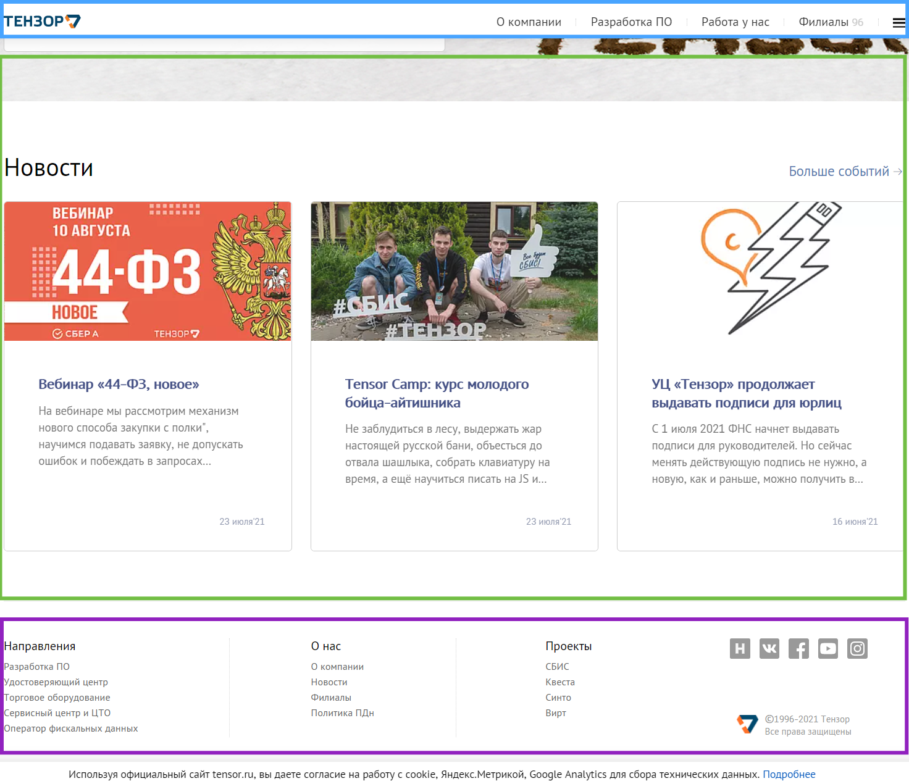

# Сетка и как работать с макетом

## Декомпозиция макета

Мы с вами рассмотрели основные возможности CSS. Теперь пришла пора применить их на практике.

Итак, вы получили свой первый макет. Что же делать?
Давайте разбираться.

Для начала стоит выделить основные блоки страницы. Обычно - это шапка (header), навигация или боковая панель, контент и подвал (footer).

Рассмотрим на примере сайта tensor.ru



Здесь можно выделить три зоны:

1. шапку (она прилипает при скролле). В ней мы видим лог и навигацию
2. основной контент - несколько секций с различным контентом
3. подвал, внутри которого находится расширенная навигация, лого, ссылки на соц. сети т.д.

Отдельного блока с навигацией у нас нет, она находится внутри header и footer.

Кстати, в качестве разминки оцените вёрстку сайта и предложите идеи для оптимизации :)

Итак, основной каркас готов. Дальше - рассмотрим заголовок (header). Мы сейчас не будем вдаваться в тонкости реализации, а лишь разобьём его на отдельные сущности.

Заголовок состоит из двух частей - логотипа и навигации.

В итоге получаем:

```html
<header class="header">
	<a class="logo">
		...
	</a>
	<nav class="nav nav_type_header">
		...
	</nav>
</header>
```

Идём дальше - логотип состоит из картинки и текста

```html
<a class="logo">
	<h1 class="logo__title">ТЕНЗОР</h1>
	
</a>
```

Для наименования классов мы используем БЭМ. В конце этого урока вы найдёте ссылки о том что это такое, зачем нужно и как использовать. А пока просто поверьте - это невероятно упрощает жизнь.

В качестве домашнего задания - декомпозируйте (разбейте на блоки) навигацию и любой другой блок на выбор. Результатами поделитесь в чате и мы их вместе обсудим.

## Заполнение контента (сетка)

Если вам повезло с дизайнером, к макету будет прикреплён специальный слой с сеткой.


Такая сетка наглядно демонстрирует как должен располагаться контент и какие отступы должны быть между элементами

Существует много способов создания сетки. Они появлялись один за другим.

Первым способом была табличная сетка. У разработчиков была возможность использовать только таблицы. И у них получались крутые проекты! Внизу урока есть пара статей про то, как сложно тогда жилось фронтенд-разработчикам, когда даже такого понятия как фронтенд не существовало. Но, табличная вёрстка все ещё жива. Например, с её помощью делают письма для почтовой рассылки из-за больших ограничений почтовых клиентов.

Следующий шаг - использование свойств `float` и `display: inline-block`. Элементы принудительно делали строчными и управляли ими с помощью обтекаемости. На многих сайтах все ещё можно встретить стиль [clear: both](https://developer.mozilla.org/ru/docs/Web/CSS/clear), который избавлял от "схлопывания" элементов.

И, сравнительно недавно, в CSS один за другим появились `display: flex` и `display: grid`.

На них остановимся подробнее.

## Flexbox

Значение расшифровывается как "flexible box" (гибкая коробка). Это свойство помогает управлять не самими блоками внутри, а пустым пространством между ними. Например, задав `margin: auto` дочернему блоку мы сможем расположить его ровно посередине.

```html
<div style="width: 300px; height: 300px; display: flex;">
	
</div>
```


Флексы позволяют управлять содержимым по одной оси, её можно менять свойством flex-direction. Оно имеет 4 значения - row, column, row-reverse, column-reverse.


Так же есть свойства для управления контетном по основной оси - justify-content:


И, конечно, по дополнительной (align-items):


Ну и элементы можно переносить на другую строку свойством flex-wrap:


Чтобы разобраться в этом получше предлагаем изучить [лучшую статью по flexbox](https://habr.com/ru/post/467049/).

А после [пройти небольшую тренировку](https://flexboxfroggy.com/#ru)

## Grid

Flexbox крут, но не позволяет красиво решить простейшую задачу - расположить 5 карточек в ряд по три с одинаковыми отступами между ними (попробуйте, придется зависнуть и что-то закостылить).

Когда Flexbox стало не хватать, ему на смену пришёл Grid, он позволил управлять контентом полноценно по двум осям и легко решал описанную выше пробле

Давайте рассмотрим пример

```html
<style>
  .grid-container {
    display: grid;
    grid-template-columns: 20% 50% 30%;
    grid-template-rows: 20% 50% 30%;
    gap: 15px;
  }

  .grid-item {
  	/* тут какие-то стили для элементов */
  }
</style>
<div class="grid-container">
  <div class="grid-item">1</div>
  <div class="grid-item">2</div>
  <div class="grid-item">3</div>
  <div class="grid-item">4</div>
  <div class="grid-item">5</div>
  <div class="grid-item">6</div>
  <div class="grid-item">7</div>
  <div class="grid-item">8</div>
</div>
```


Всего четырьмя свойствами мы смогли расположить контент. `grid-template-columns` задал размеры колонок, `grid-template-rows` - размеры строк, а `gap` - отступы между ними.

Подробнее с технологией мы предлагаем ознакомиться в [статье](https://tuhub.ru/posts/css-grid-complete-guide), а закрепить знания в [тренажёре](https://cssgridgarden.com/#ru).

## Адаптивная верстка

Круто, мы разобрались с декомпозицией и сеткой. А что же делать с различными размерами экрана спросите вы. Мобильные телефоны, планшеты, ноутбуки, десктопы, телевизоры в конце концов. Верстать новый сайт для каждого из приложений? Можно, но это затратно, сложно и медленно.

Существуют два подхода - mobile first и desktop first. Их суть ясна из названия

1. Mobile first - делаем вёрстку для мобильных устройств, а затем пишем по возрастанию.
2. Desktop first - начинаем с самого большого экрана (обычно это десктопный ПК) и заканчиваем мобильным устройством.

И оба этих подхода были бы невозможны, если бы CSS не умел применять разные стили к разным экранам.

Здесь нам на помощь приходит директива `@media`

```css
@media only screen and (min-width: 300px) and (max-width: 600px) {
  body {
    background-color: wheat;
  }
}
```

Мы указали браузеру, что при ширине рабочей области (viewport) от 300 до 600 пикселей у body должен быть фон пшеничного цвета.

Обычно используют либо только `min-width`, либо `max-width`. Цифры внутри называют брейкпоинтами. Это те значения ширины, на которых сайт должен менять своё отображение.

## Заключение

Мы с вами рассмотрели ключевые понятия вёрстки. Мы коснулись лишь верхушки огромного айсберга, дополнительные материалы вы можете попросить у наставника в чате, а так же не стесняйтесь делиться найденными курсами/статьями/книгами в чате.

Дополнительные материалы

- [Использование медиавыражений](https://developer.mozilla.org/ru/docs/Web/CSS/Media_Queries/Using_media_queries)
- [CSS Flexbox Guide](https://css-tricks.com/snippets/css/a-guide-to-flexbox/) ([на русском](https://habr.com/ru/post/467049/))
- [CSS Grid Guide](https://css-tricks.com/snippets/css/complete-guide-grid/) ([на русском](https://tuhub.ru/posts/css-grid-complete-guide))
- [Копия facebook с табличной вёрсткой](https://habr.com/ru/company/ruvds/blog/564300/) (необязательно)
- ~~[Верните мой 2007~~ Верстать как в 2008](https://www.youtube.com/watch?v=mE1AvBP08Cs) (необязательно)
- [БЭМ за 17 минут](https://www.youtube.com/watch?v=HihYQVuH64U&t=1s)
- [Адаптивная вёрстка](https://www.youtube.com/watch?v=XbnAKjjlgc4)