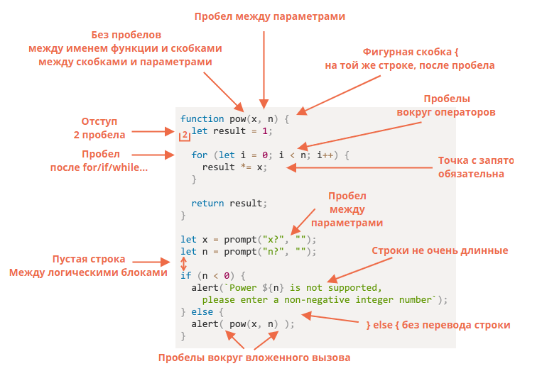

# Базовый синтаксис

JavaScript предполагает достаточно свободный, по сравнению с некоторыми другими языками, базовый синтаксис кода.
Рассмотрим его подробнее.

## Точка с запятой и другие разделители

Программа на JavaScript представляет собой последовательность инструкций. 
Инструкции – это синтаксические конструкции и команды, которые выполняют определенные действия.
Инструкции рекомендуется разделять символом точки с запятой - ";". В некоторых случаях этого можно не делать, если между инструкциями использован перевод строки, а сами инструкции просты и их логика однозначна.

Например, следующий код достаточно однозначен, чтобы корректно выполниться без каких-либо проблем:

```javascript
const message = 'Привет, мир!'
alert(message)

```

В то время как этот код уже вызовет ошибку:

```javascript
const message = 'Привет, мир!'
alert(message)
[1, 2].splice(1)

```

В примере выше интерпретатор посчитает, что конструкция в угловых скобках относится к предыдущей строке и попытается выполнить код вида:

```javascript
alert(message)[1, 2].splice(1)
```
Но поскольку функция alert() ничего не возвращает, то попытка выполнить подобную инструкцию вызовет ошибку.


## Длина строки

JavaScript не накладывает никаких ограничений на длину строки.
Можно размещать несколько инструкций в одной строке, разделяя их точкой с занятой.
Либо, напротив, можно разделить одну инструкцию на несколько строк, если это продиктовано соображениями удобства и читабельности кода:

```javascript
const message = 'Привет, мир!'; let i = 0; let max = 10;

alert(
    message
);

```

## Комментарии

Хороший стиль написания кода подразумевает обязательное наличие коментариев.
В JavaScript комментарии могут быть однострочными и многострочными.

Однострочный комментарий начинается с двух символов слэша. Он может быть вынесен в отдельную строку, либо комментарий можно разместить в конце строки с инструкциями:

```javascript
// Это пример однострочного комментария
const message = 'Привет, мир!'; // И это тоже пример однострочного комментария

```

Многострочный комментарий задается при помощи символов /* */:

```javascript
/*
Это пример многострочного комментария.
Часто он используется, например, для того, 
чтобы временно отключить выполнение 
некоторых участков кода, как здесь:

const message = 'Привет, мир!'; let i = 0; let max = 10;

alert(
    message
);
*/

```


## Комментарии в стиле JSDoc

Существует замечательный автоматический генератор документации JSDoc, который на основании комментариев в исходном коде на JavaScript формирует документацию в HTML-формате. Использование подобного генератора существенно облегчает жизнь и разработчикам, и создателям документации, поэтому мы рекомендуем писать комментарии в стиле JSDoc.

Комментарий в стиле JSDoc предваряет объявление функций и выглядит следующим образом:

```javascript
/**
* Создает новый экземпляр Circle по диаметру.
*
* @param {number} d Диаметр окружности.
* @return {Circle} Новый объект Circle.
* 
* @static
*/

```

Он включает в себя описание функции, ее модификаторы (например, static или private), а также входящие и исходящие параметры с указанием их типа данных и назначения.


## "Строгий" режим написания кода

Язык JavaScript стремительно развивается, вследствие чего он постоянно дополняется новыми возможностями. При этом, для обеспечения работоспособности старого кода, все его старые возможности также поддерживаются, включая и те, которые в настоящее время представляются устаревшими ("Legacy code").

Особенно актуально это стало в 2009 году, когда появился стандарт ECMAScript 5. Он добавил новые возможности в язык и изменил некоторые из существующих. Чтобы устаревший код работал, как и раньше, по умолчанию подобные изменения не применяются. Поэтому нам нужно явно их активировать с помощью специальной директивы: "use strict".

Директива выглядит как обычная строка: "use strict" или 'use strict'. 
Когда она находится в начале скрипта, весь сценарий работает в "современном" режиме.

Например:

```javascript
"use strict";

// этот код работает в современном режиме
...

```

Строгий режим принёс ряд изменений в обычную семантику JavaScript. 
Во-первых, он заменяет исключениями некоторые ошибки, которые интерпретатор JavaScript ранее молча пропускал. 
Во-вторых, строгий режим исправляет ошибки, которые мешали JavaScript выполнять оптимизацию. 
В-третьих, строгий режим запрещает использовать некоторые элементы синтаксиса, которые, вероятно, в следующих версиях ECMAScript получат особый смысл.


## Code style как стандарт разработки

Несмотря на то, что JavaScript в целом нетребователен к оформлению кода, большинство компаний, использующих JavaScript в качестве языка разработки, формулируют для своих сотрудников определенные стандарты разработки, в которых формализуется в том числе и стиль написания кода.

Следование хорошему стилю написания кода, включая и унифицированное оформление, делает его более читабельным и понятным.
Один из распространенных вариантов хорошего оформления кода приведен на изображении ниже.




### Статьи по теме

[Основы JavaScript. Структура кода.](https://learn.javascript.ru/structure)
[Справочник по JavaScript. Лексический синтаксис](https://developer.mozilla.org/ru/docs/Web/JavaScript/Reference/Lexical_grammar)
[Советы по стилю кода](https://learn.javascript.ru/coding-style)
[JSDoc](https://ru.wikipedia.org/wiki/JSDoc)
