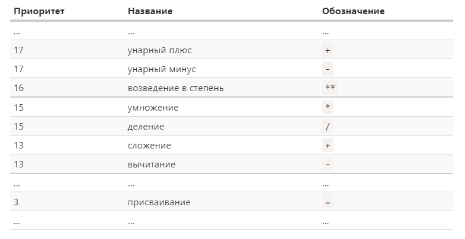

# Арифметические операторы

Язык JavaScript поддерживает все базовые математические операции: сложение, умножение, вычитание, возведение числа в степень и т.д., благодаря чему мы можем осуществлять любые арифметические преобразования значений переменных.

Каждая операция представляет собой тот или иной оператор (например, оператор сложения или умножения), применяемый к одному или нескольким операндам. Таким образом, операнд – это то, к чему применяется оператор. Например, в операции умножения 4 * 2 мы видим два операнда: левый операнд равен 4, правый операнд равен 2. Их также часто называют «аргументами» вместо «операндов».

Операторы могут быть унарными или бинарными.
Унарным называется оператор, который применяется к одному операнду. Например, оператор «унарный минус» (-) меняет знак числа на противоположный:

```javascript
let x = 2;
let y = -x;
alert(y); // -2
```

Бинарным называется оператор, который применяется к двум операндам:

```javascript
let x = 4, y = 2;
alert(x * y); // 8
```

Рассмотрим подробнее арифметические операторы, которые поддерживает JavaScript.

- Сложение (+),
- Вычитание (-),
- Умножение (*),
- Деление (/),
- Взятие остатка от деления (%),
- Возведение в степень (**).

Например:

```javascript
alert(5 % 2); // 1, остаток от деления 5 на 2
alert(2 ** 3); // 8 (2 * 2 * 2)
```

Имеет смысл упомянуть, что оператор сложения (+) может применяться не только к числам, но и к строкам. В этом случае он объединит их в одну строку:

```javascript
let s = "Java" + "Script";
alert(s); // JavaScript
```

Если хотя бы один операнд является строкой, то и второй будет тоже преобразован в строку:

```javascript
alert( 2 + 2 ); // 4
alert( 2 + '2' ); // "22"
```

Для приведения переменной к числу можно также использовать унарный плюс (+):

```javascript
alert(+true); // 1
alert(+'45'); // 45
```

##Приоритет операторов

Существует определенный порядок, в котором интерпретатор выполняет операторы в арифметическом выражении. Этот порядок определяется при помощи приоритетов, заданных для каждого оператора. Документация по JavaScript содержит развернутую [таблицу приоритетов](https://developer.mozilla.org/ru/docs/Web/JavaScript/Reference/Operators/Operator_Precedence). Мы приведем здесь фрагмент из нее в качестве иллюстрации:



Операторы с более высоким приоритетом выполняются первыми. Если приоритет одинаковый, то порядок выполнения будет слева направо. При этом, порядок выполнения операторов можно изменить, используя скобки.


##Присваивание

В таблице приоритетов также есть оператор присваивания (=), о котором мы ранее не упоминали. У него один из самых низких приоритетов: 3. Поэтому, когда переменной присваивают некое значение (например, a = b ** 2 + 1), то сначала выполняются арифметические действия, а затем произойдёт присваивание с сохранением результата в переменную a.

Большинство операторов в JavaScript возвращают значение. Оператор присваивания в этом смысле не является исключением.
Вызов x = value записывает value в x и возвращает его.

Поэтому присваивание можно использовать и как часть более сложного арифметического выражения:

```javascript
let a = 10;
let b = 20;
let c = 30 - (a = b + 10);

alert(a); // 30
alert(c); // 0
```

В этом примере результатом вычисления выражения a = b + 10 будет значение, которое присваивается переменной a (то есть 30). 
Однако подобный код бывает сложен для понимания и им не стоит злоупотреблять. В отличие, например, от сокращенной арифметики с присваиванием, синтаксис которой вполне прозрачен и понятен.


##Сокращённая арифметика с присваиванием

Часто нужно применить оператор к переменной и сохранить результат в ней же. Например:

```javascript
let m = 10, n = 20;
m = m * 2;  // 20
n = n + 5;  // 25
```

Эту запись можно сделать короче и лаконичнее при помощи совмещённых операторов += и *=:

```javascript
let m = 10, n = 20;
m *= 2; // 20
n += 5; // 25
```

Подобные краткие формы записи существуют для всех арифметических операторов: /=, -= и т.д.


##Инкремент/декремент

Одной из наиболее частых арифметических операций является увеличение или уменьшение значения переменной на единицу.
Для этого в JavaScript существуют специальные унарные операторы: инкремент (++) и декремент (--). Инкремент увеличивает переменную на 1, в то время как декремент - уменьшает на 1:

```javascript
let counter = 10;
counter++; 
alert(counter); // 11
```

Операторы инкремента и декремента могут быть расположены не только после, но и до переменной. Если оператор идёт после переменной — это т.наз. «постфиксная форма»: counter++. «Префиксная форма» — когда оператор идёт перед переменной: ++counter.

Обе эти инструкции делают одно и то же: увеличивают значение переменной на 1, однако префиксная форма увеличивает значение и возвращает новое инкрементированное значение, в то время как постфиксная форма также увеличивает значение переменной, но возвращает старое значение (которое было до увеличения):

```javascript
let x = 10, y = 10;

alert(++x); // 11
alert(y++); // 10

alert(x); // 11
alert(y); // 11
```

### Статьи по теме:

[Основы JavaScript. Базовые операторы, математика](https://learn.javascript.ru/operators)
[Руководство JavaScript. Выражения и операторы](https://developer.mozilla.org/ru/docs/Web/JavaScript/Guide/Expressions_and_Operators)
[Операции с переменными](https://metanit.com/web/javascript/2.3.php)
[Приоритет операторов](https://developer.mozilla.org/ru/docs/Web/JavaScript/Reference/Operators/Operator_Precedence)