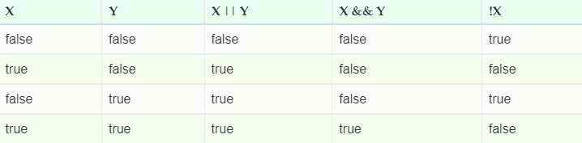

# Логические операторы JavaScript

В условных конструкциях JavaScript, таких, как if, while или for, очень часто используются логические операторы.
Язык JavaScript содержит три таких логических оператора: || (Логическое ИЛИ), && (Логическое И) и ! (Логическое НЕ), при помощи которых реализуются логические условия любого уровня сложности.

## Оператор && (Логическое И)

Оператор И (&&) выполняет логическую операцию конъюнкции двух булевых значений. Конъюнкция – это сложное логическое выражение, которое считается истинным (true) только в том случае, когда оба его операнда (выражения) являются истинными. Во всех остальных случаях данное выражение ложно (false).

Например:

```javascript
  alert( true && true ); // true
  alert( false && true ); // false
  alert( true && false ); // false
  alert( false && false ); // false
```

В реальных ситуациях логические операторы И и ИЛИ чаще всего используются совместно с двумя или более выражениями сравнения, например:

```javascript
  const x = 0, y = 0;
  alert( х == 0 && у == 0 ); // true
```

Для оператора Логическое И (&&) не обязательно, чтобы его операнды были булевыми значениями. Благодаря встроенному приведению типов, логические операторы могут применяться к значениям любых типов, которые при этом будут преобразованы к булевыми типам.
Например, в следующем примере число 1 будет воспринято как true, а 0 – как false:

```javascript
    const result = (1 && 0); // сработает как (true && false)
    alert( result ); // 0
```

Логическое И начинает работу с вычисления левого операнда. Если получившееся значение может быть преобразовано в false (например, null, undefined, 0, –0, NaN или ""), значит, результат выражения равен false или непреобразованному значению левого выражения. Поэтому вычисление и преобразование второго операнда не выполняется. В противном случае, если значение слева является истинным, тогда результат всего выражения определяется значением справа:

```javascript
  alert( null && 50 ); // null
  alert( 0 && "hello" ); // 0
  alert( NaN && "12.33" ); // NaN
```

## Оператор || (Логическое ИЛИ)

Оператор Логическое ИЛИ вычисляет дизъюнкцию двух операндов. Если хотя бы один или оба операнда преобразуются в true, он возвращает true или непреобразованное значение. Если же оба операнда преобразуются в false, он возвращает false или непреобразованное значение.

Логическое ИЛИ (||), как и логическое И (&&) поддерживает сокращенные вычисления.

В примере ниже правый операнд не оценивается, потому что левый уже эквивалентен значению true:
 
```javascript
  const x = 10;
  alert( 1 || ++y ); // ++y не будет вычисляться
```

Но если левый операнд имеет значение false может быть преобразован в false, оператор || переходит к вычислению значения правого операнда и возвращает его значение:

```javascript
  alert( null || 0 ); // вернёт правое значение
```

## Оператор ! (Логическое НЕ)

Оператор НЕ (!) является унарным оператором, помещаемым перед операндом. Он преобразует значение своего операнда в булево значение, после чего инвертирует это значение в противоположное и возвращает полученное булево значение.

Например:

```javascript
  alert ( !false ); // true
  alert ( !0 ); // true
  alert ( !"hello" ); // false
  alert ( !NaN); // true
  alert ( !"" ); // true
  alert ( !10 ); // false
  alert ( !null ); // true
```

Поскольку оператор НЕ всегда возвращает true или false, его удобно использовать для преобразования любого значения в его логический эквивалент, дважды применив этот оператор:

```javascript
  alert ( !!NaN); // false  
  alert ( !!"" ); // false  
  alert ( !!10 ); // true  
  alert ( !!null ); // false 
```

## Комбинирование логических операторов

При помощи комбинирования описанных выше логических операторов можно формулировать логические условия любой степени сложности. 
При этом оператор НЕ (!), будучи унарным, имеет высокий приоритет и тесно связан с своим аргументом. Приоритет оператора И (&&) больше, чем приоритет оператора ИЛИ (||). Поэтому в следующем примере сначала будет вычислено правое логическое И (&&), а уже потом – ИЛИ (||):

```javascript
  const x = 7, y = null, z = 9;
  alert( z || x && y ); // 5  
```

Изменить результат сложного выражения, да и просто сделать код более понятным и читабельным, можно применив в выражении скобки:

```javascript
  var x = 7, y = null, z = 9;
  alert( (z || x) && y ); // null  
```

## Таблица истинности

Логические операторы работают с операндами так же, как и с булевыми значениями, возвращая true или false, поэтому эти операции можно описать таблицей истинности, в которой указано их поведение:



### Статьи по теме:

[Основы Javascript. Логические операторы](https://learn.javascript.ru/logical-operators)
[Javascript. Логические операторы](https://wm-school.ru/js/js_booleans.php)
