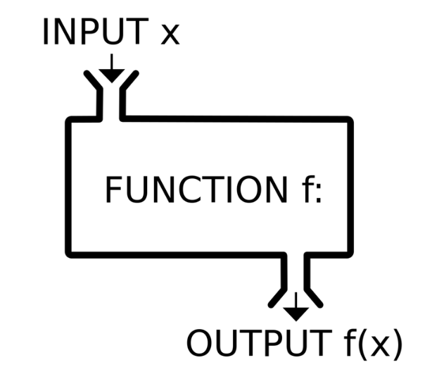

# Функции

Нередко оказывается необходимым повторять набор одних и тех же действий во многих частях программы.
Для того, чтобы не дублировать код во многих местах, были придуманы функции. Другими словами, функция - это фрагмент кода, который можно вызвать в любом месте программы без дополнительных условий. Существует множество уже готовых функций, которые предоставляет JavaScript и, конечно, мы также всегда можем написать свои собственные функции.


Функции являются основными «строительными блоками» программы. 
Любая функция может иметь ряд входных параметров и может вернуть результат.




## Создание функции

Для создания функций мы можем использовать объявление функции. 

Объявление функции включает в себя:
- Имя функции,
- Список параметров, принимаемых функцией, заключённых в круглые скобки и разделённых запятыми,
- Инструкции, которые будут выполнены после вызова функции, заключают в фигурные скобки.


```javascript
/**
 * Комментарий к функции с описанием ее работы
 * Назначение функции
 * @param {*} Параметры функции и их тип
 * @return Результат работы
 */
function имя([параметры]) {
    // Тело функции
    [return результат;]
}
```

Рассмотрим эти моменты чуть подробнее.


### Название функции

Существуют как формальные, так и неформальные требования к именованию функции.

Формальные требования сводятся к тому, что имя функции должно соответствовать тем же условиям, которые существуют для именования переменных (см. соответствующий [раздел](https://pro-edu.tensor.ru/tensor/lesson/page.php?id=3166&sectionid=4&pageid=4)).

К неформальным требованием можно отнести соглашение, что *название функции должно четко и ясно описывать, что именно делает функция*. 
Например, если функция очищает ячейку таблицы, то логично дать ей название в стиле clearCell(), emptyСell() или removeDataFromCell().

Отсюда логически вытекает следующее соглашение: *название функции обычно начинается с глагола*: get*, set*, create*, prepare*, make*, remove* и т.д.

Из этого, в свою очередь, неизбежно следует требование, что *одна функция выполняет только одно действие*. Все инструкции, составляющие тело функции, должны служить лишь одной задаче, отраженной в названии функции.


### Список параметров, принимаемых функцией

Мы можем передать внутрь функции любую информацию, используя *параметры функции*:

```javascript
/**
 * Находим большее из двух чисел
 * @param {number} value1 Первое число
 * @param {number} value2 Второе число
 * @return {number} Найденный максимум
 */
function getMax(value1, value2) {
    return value1 > value2 ? value1 : value2;
}

alert(getMax(10, 11));  // 11
```

Если параметр описан при создании функции, но не указан при ее вызове, то его значением становится undefined.
Существует возможность задать *параметры по умолчанию (default parameters)*. 
В этом случае, если параметр не передан, он получит некое заранее предопределенное значение:

```javascript
/**
 * Выводим приветствие пользователю
 * @param {string} Имя пользователя
 */
function sayHello(name = 'Гость') {
    alert(`Приветствую, ${name}!`);
}

sayHello('Виталий');    // Приветствую, Виталий!
sayHello();             // Приветствую, Гость!
```

Независимо от того, сколько параметров указано при объявлении функции, при вызове функции можно передавать в нее *любое* количество аргументов. Если передано меньше аргументов, чем указано параметров при объявлении функции, недостающие параметры, как было описано выше, получат значение undefined. Если же передано больше аргументов, чем указано при объявлении функции, это не вызовет ошибку, а доступ к ним можно получить при помощи массива *arguments*.

```javascript
/**
 * Находим большее из любого количества чисел
 * @return {number} Найденный максимум
 */
function getMax() {
    let max = 0;
    // Получаем доступ к переданным аргументам через предопределенный массив arguments
    for (let i = 0; i < arguments.length; i++) {
        if (max < arguments[i]) max = arguments[i];
    }
    return max;
}

getMax(10, 20, 15);             // 20
getMax(1, 2, 15, 55, 0, -1);    // 55
```

### Возврат значения

Функция может вернуть результат, который будет передан в вызвавший её код. 
Директива *return*, которая передает "наружу" результат работы функции, может находиться в любом месте тела функции. 
Как только выполнение доходит до этого места, функция останавливается и значение возвращается в вызвавший её код.
Вызовов return может быть несколько, например, в разных ветях *if-else* или *switch-case*.
Если же в теле функции нет оператора return или используется пустой return, то результат функции будет всегда undefined.


## Функциональные выражения

Другой способ объявить функцию - использовать *функциональное выражение*.
В этом случае функция объявляется при инициализации переменной:

```javascript
const имя = function [еще_имя]([параметры]) {
    // Тело функции
    [return результат;]
};
```

Эта запись вполне валидна благодаря тому, что в JavaScript функция является *типом данных*. А значит, функции можно присваивать и переприсваивать переменным, передавать в качестве аргумента другой функции, возвращать как результат ее работы. 
Необязательное *еще_имя* может быть использовано для упрощения отладки кода или для рекурсивного обращения функции к себе самой. 
При этом функцию, объявленную как функциональное выражение, нельзя вызвать в коде до ее объявления.

Функциональные выражения особенно удобны, когда функция передаётся аргументом другой функции, например:

```javascript
function getData(id, callback, errback) {
    let result = getFromDB(id);
    return result ? callback(result) : errback();
}

getData(
    5,
    function(res) { setToElement(res); },
    function() { alert('Ошибка получения данных'); }
);
```

В этом примере в функцию getData() передается не только идентификатор данных, которые требуется получить, но и функции, которые сразу будут выполнены в зависимости от полученного результата. Например, функция errback() может вывести сообщение об ошибке, а функция callback() как-то дополнительно подготовить данные и т.д.

## Стрелочные функции

Стрелочные функции - еще одна альтернативная нотация, рекомендованная в новой спецификации.
Все нижеприведенные способы объявления являются вариантами стрелочной функции:

```javascript
    let имя = (параметры) => выражение;
    
    let имя = параметр => выражение;
    
    let имя = () => выражение;
    
    let имя = (параметры) => {
        // тело функции
        return результат;
    };
```

Как видим, этот способ отличается от предыдущего варианта краткостью кода, но не только.
Например, стрелочная нотация лексически связывает значение *this*. Кроме того, стрелочные функции всегда анонимны и у них нет встроенного псевдомассива *arguments*.


## Немедленно вызываемая функция (IIFE)

Немедленно вызываемая функция (Immediately Invoked Function Expression — IIFE) в JavaScript — это конструкция, позволяющая вызывать функцию непосредственно после ее определения. В ряде случаев такая конструкция может использоваться для изоляции данных.
В примере ниже все переменные, использованные внутри IIFE-функции, будут полностью изолированы и не видны нигде "снаружи". 
Аналогично, если "снаружи" есть некие переменные, совпадающие с переменными, используемыми внутри такой функции, наличие таких переменных никак не повлияет на работу IIFE-функции.

Чтобы превратить обычную функцию в IIFE-функцию, достаточно обернуть ее круглыми скобками и приписать вызов функции через "()".

```javascript
    (function(id) {
        // тело функции
    })();
```

Такими функциями вполне могут быть и стрелочные функции:

```javascript
    (() => alert('Привет, мир!'))();
```


## Анонимные функции

Во многих случаях функции могут объявляться без имени - например, объявляться сразу как аргумент другой функции или как результат работы функции.
Пример такого создания анонимной функции мы уже видели в примере выше:

```javascript
    getData(
        5,
        function(res) { setToElement(res); },       // Это анонимная функция
        function() { alert('Ошибка получения!'); }  // И это тоже анонимная функция
    );
```

### Статьи по теме

[Руководство JavaScript. Функции](https://developer.mozilla.org/ru/docs/Web/JavaScript/Guide/Functions)
[Основы JavaScript. Функции](https://learn.javascript.ru/function-basics)
[Функции в JavaScript: секреты, о которых вы не слышали](https://habr.com/ru/company/otus/blog/530214/)
