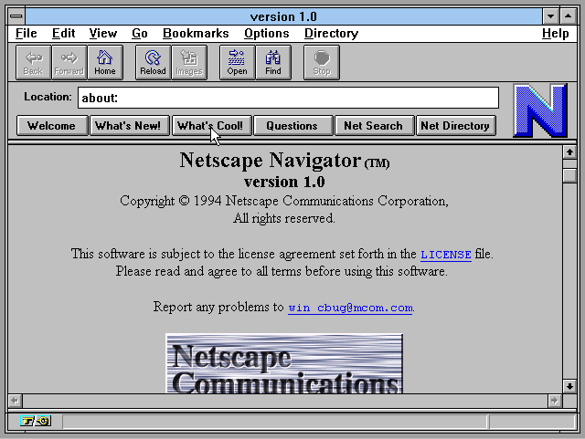

# История создания JavaScript

Структура HTML-документа изначально содержала лишь простейшие средства оформления текста (теги), изображения и ссылки на другие веб-документы. Позднее разработчики добавили возможность вставки и проигрывания звуковых файлов и видео. Но вскоре стало очевидно, что этого инструментария явно недостаточно и необходимо найти способ, чтобы сделать HTML-страницы более интерактивными. Другими словами, нужно было встроить внутрь HTML-страниц некий скриптовый язык.

Первые попытки создать такой встраиваемый язык предприняла в 1992 году компания Nombas. Скриптовый язык, который она разрабатывала, сначала назывался Cmm, затем был переименован в ScriptEase. Страницы, которые можно было изменять с помощью этого языка, получили название Espresso Pages — они демонстрировали использование ScriptEase для валидации пользовательского ввода и создания анимации.

Что же касается языка JavaScript, то его история связана в первую очередь с компанией Netscape Communications, разработчиком браузера Netscape Navigator. В далеком 1995 году она наняла Брендана Эйха, который должен был внедрить язык программирования Scheme или что-то похожее в браузер Netscape.

Помимо Брендана Эйха, в разработке участвовали сооснователь Netscape Communications Марк Андрессен и сооснователь Sun Microsystems Билл Джой. Чтобы успеть закончить работы над языком к релизу браузера, компании заключили соглашение о сотрудничестве в разработке.

Первоначально создаваемый ими язык назывался Mocha, затем он был переименован в LiveScript и предназначался как для программирования на стороне клиента, так и для программирования на стороне сервера. В процессе создания на JavaScript оказали влияние многие языки, но в наибольшей степени разработчики старались сделать новый язык похожим на похожим на Java, поскольку он был очень популярен в 1994-1995 годах. По той же причине LiveScript позже переименовали в JavaScript, получив соответствующую лицензию у Sun.

Анонс JavaScript со стороны представителей Netscape и Sun состоялся накануне выпуска второй бета-версии Netscape Navigator. Конкуренты компании Netscape, разумеется, не оставили без внимания этот новаторский прорыв. Началась эпоха бурного развития браузерных технологий. В 1996 году компания Microsoft выпустила аналог языка JavaScript, названный JScript. Ее первым браузером, поддерживающим эту реализацию, был Internet Explorer 3.0.

Сначала Netscape и Microsoft использовали одинаковые стратегии развития своих браузеров. В конкурентной борьбе они создавали свои различные расширения первоначальной версии языка JavaScript, которые не были совместимыми. На этом пути были созданы браузеры Netscape Navigator 4.x и Microsoft Internet Explorer 4.x, Между JavaScript от Netscape и Jscript от Microsoft было много общего, но имелись и существенные различия.

В конечном итоге, спустя несколько лет, для создания основы для обеспечения межбраузерной совместимости в отношении языка JavaScript была выработана стандартная спецификация ЕСMA Script (ЕСМА-262) для языка сценариев, встраиваемых в Web-страницы. В настоящее время самой последней является 11-я версия стандарта (ECMAScript 2020, 11th edition). Все современные браузеры теперь объявляют полную поддержку стандарта ЕСМА-262 той или иной редакции, но некоторые из них имеют и дополнительные возможности (расширения).

### Статьи по теме:

[JavaScript](https://ru.wikipedia.org/wiki/JavaScript#JavaScript)
[Язык JavaScript: история возникновения, версии и стандарты](https://owlweb.ru/yazyk-javascript-istoriya-vozniknoveniya-versii-i-standarty/)
