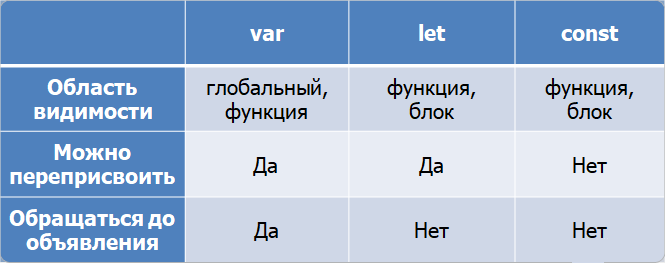

# Переменные в JavaScript

В процесе работы приложению, как правило, требуется взаимодействовать с некими данными. 
Переменная – это именованное хранилище для таких данных. Присвоенные переменной данные сохраняются в области памяти, связанной с этой переменной. Мы можем получить доступ к этим данным, используя имя переменной (т.е. ее уникальный идентификатор).


## Идентификаторы JavaScript

Все переменные в JavaScript должны иметь уникальные имена. Эти имена называются идентификаторами. Они могут быть как предельно короткими (например, x и y), так и более описательными (age, sum, totalResult).

Существуют общие правила для создания имен переменных:

- Имена могут содержать буквы, цифры, символы подчеркивания (_) и знаки доллара ($),
- Имена должны начинаться с буквы, либо символа доллара ($) или нижнего подчеркивания (_),
- Имена чувствительны к регистру (y и Y - разные переменные),
- Зарезервированные слова (например, такие, как for или const) нельзя использовать в качестве имен,
- Нелатинские буквы разрешены (допускается использовать любой язык, включая кириллицу или иероглифы), но не рекомендуются.


## Объявление переменных в JavaScript
Мы можем объявить переменные в скрипте JavaScript с помощью ключевых слов var, let или const.

При этом необходимо помнить, что:
- var – это устаревший способ объявления, но его можно очень часто встретить в старых фрагментах кода,
- let – это современный способ объявления переменных,
- const – это современный способ объявления переменных, значения которых не могут изменяться в будущем.

При этом, очень часто создание переменной совмещают с ее начальной инициализацией. Например:

```javascript
let a = 10;
const KB = 1024;
```

Также допускается объявлять несколько переменных в одной строке:

```javascript
let x = 100, y = 200, message = 'Hello';
```

Особенности работы с переменными, объявленными при помощи ключевых слов var, let или const можно свести в небольшую таблицу:


Переменная может быть объявлена только один раз. Повторное объявление той же переменной является ошибкой.

Следует также упомянуть, что можно использовать переменную и без ее формального объявления:

```javascript
x = 10;
alert(x); // 10
```

Но делать так категорически не рекомендуется.
В этом случае будет создано новое свойство у глобального объекта JavaScript (window в случае выполнения кода в браузере) и все дальнейшие манипуляции будут происходить с ним. При этом не исключена ситуация, когда такое свойство глобального объекта будет случайно перезаписано свойством с аналогичным именем, которое будет создано в каком-то другом модуле проекта. 
Возможна также ситуация, когда где-то выше в коде будет активирован "строгий режим" (strict mode) работы JavaScript, а в этом режиме использование переменных без объявления не допускается, что приведет к ошибке выполнения скрипта:

```javascript
'use strict';
x = 10; // Ошибка ReferenceError: x is not defined
```

### Статьи по теме

[Основы JavaScript. Переменные](https://learn.javascript.ru/variables)
[JavaScript Переменные](https://schoolsw3.com/js/js_variables.php)
[Переменные - место хранения необходимой информации](https://developer.mozilla.org/ru/docs/Learn/JavaScript/First_steps/Variables)
