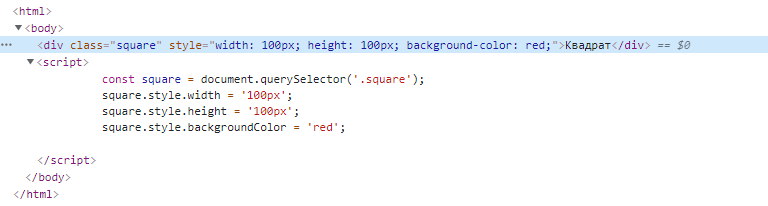

# Стили

Для работы со стилями элемента в JavaScript применяются, главным образом, два подхода:

* Написание стилей в атрибуте **style** элемента;
* Управление **классами** элемента.

С точки зрения способа задания стилей для элемента **классы** являются более предпочтительным вариантом по сравнению со **style**. Использование **style** является приемлемым, если мы вычисляем какие-либо свойства элемента динамически и хотим установить их из JavaScript.

## Свойство style элемента

Управлять стилями элемента при помощи JavaScript можно через DOM-свойство *style*. Значением данного свойства является особый объект [CSSStyleDeclaration](https://developer.mozilla.org/ru/docs/Web/API/CSSStyleDeclaration), он доступен только для чтения. Установка стилей осуществляется посредством добавления к нему соответствующих свойств, например:

```html
<html>
    <body>
        <div class="square">Квадрат</div>
        <script>
            var square = document.querySelector('.square');
            square.style.width = '100px';
            square.style.height = '100px';
            square.style.backgroundColor = 'red';
        </script>
    </body>
</html>
```

С точки зрения инспектора свойств в браузере стили будут применены к элементу в виде атрибута *style*:



Имена свойств объекта *CSSStyleDeclaration* обычно совпадают с названиями CSS-свойств. Если имя CSS-свойства содержит дефисы, то в таком случае имя свойства объекта *CSSStyleDeclaration* образуется путем удаления дефисов и перевода в верхний регистр буквы, непосредственно следующей за каждым из них. Например, CSS-свойство *background-color* доступно через свойство *backgroundColor*, CSS-свойство с браузерным префиксом *-webkit-border-radius* доступно через *WebkitBorderRadius*.

Исключением является свойство *float*, т.к. слово *float* является зарезервированным в стандарте языка JavaScript, поэтому его использование в стилевых свойствах невозможно. К нему добавляется префикс «css», пример:

```js
elem.style.cssFloat = 'left';
```

> Обратите внимание, при работе со свойствами стиля объекта *CSSStyleDeclaration* все значения должны задаваться в виде строк. Также не нужно забывать добавлять к значениям единицы измерения.

### Удаление стилей

Например, установим для *body* некоторый размер шрифта:

```js
document.body.style.fontSize = '20px';
```

Чтобы сбросить поставленный стиль, нужно присвоить этому свойству пустую строку:

```js
document.body.style.fontSize = '';
```

### Свойство cssText

Прописывать в виде нескольких строк целый ряд css-свойств для элемента не всегда удобно, например, когда таких свойств много. На этот случай есть свойство *cssText*, с помощью которого можно задать нескольких стилей в одной строке:

```js
document.body.style.cssText = 'width: 100px; height: 100px; background-color: red;';
```

Однако, это свойство удаляет все стили, которые до этого были у элемента в атрибуте *style*.

Выполнить операцию, аналогичную той, которую выполняет свойство *cssText*, можно еще через метод *setAttribute*:

```js
document.body.setAttribute('style', 'width: 100px; height: 100px; background-color: red;');
```

## Управление классами элемента

Работа со стилями элементов при помощи классов предполагает, что вы имеете таблицу стилей, связанную с вашим HTML-файлом с некоторым количеством классов в ней. 

### Свойство className

Один из способов взаимодействия с классами элемента — это использование DOM-свойства *className* (слово *class* является зарезервированным, аналогично *float*). С его помощью можно назначить класс для элемента:

```js
elem.className = 'red';
```

DOM-свойство *className* и атрибут *class* всегда синхронизуются между собой — при изменении одного меняется и другое. Указывая различные классы в атрибуте *class* и описывая их в CSS, мы можем комбинировать набор стилевых свойств.

Если мы присваиваем что-то *elem.className*, то надо учитывать, что прежнее значение атрибута *class* удаляется. Поэтому, если нам надо добавить класс, надо объединить его название со старым классом:
```js
elem.className = elem.className + ' red';
```

Чтобы удалить все классы, достаточно в это свойство записать пустую строку:
```js
elem.className = '';
``` 

Для управления множеством классов гораздо удобнее использовать свойство *classList*.

###Свойство classList

Свойство classList представляет собой специальный объект [DOMTokenList](https://developer.mozilla.org/ru/docs/Web/API/DOMTokenList), который содержит методы для выполнения различных операций над классами элемента.

Методы *classList*:

* *.add( className1 [,className2,...] )* — добавляет один или несколько указанных классов к элементу.

* *.remove( className1 [,className2,... ] )* — удаляет один или несколько указанных классов у элемента.

* *.contains( className )* – проверяет наличие класса у элемента. Возвращает *true* или *false*.

* *.toggle( className [,flag] )* — переключает указанное имя класса у элемента.

Простой пример:

```js
elem.classList.add('red', 'blue'); // Добавили классы red и blue
elem.classList.remove('blue'); // Удалили класс blue
elem.classList.contains('blue'); // false, т.к. класс blue был удален
elem.classList.toggle('red'); // Переключили (удалили) класс red
```

Объект *classList* является псевдомассивом, т.е. его можно перебрать как массив:

```html
<body class="square red">
    <script>
        for (var name of document.body.classList) {
            alert(name); // square, red
        }
    </script>
</body>
```

Свойство *classList* поддерживается всеми современными браузерами. Если нужна поддержка совсем старых браузеров (например, Internet Explorer 8, 9), то в этом случае можно воспользоваться каким-нибудь полифиллом.

> Не стоит забывать, что выполнить операции, связанные с классами элемента, можно используя методы для управления атрибутами: *hasAttribute, getAttribute, setAttribute, removeAttribute*.

## Чтение стилей getComputedStyle

Чтобы получить стили для HTML-элемента из CSS-файла, использовать свойство *style* не получится.

Поэтому для получения стилевых свойств элемента используется метод *window.getComputedStyle()*. Он возвращает объект *CSSStyleDeclaration*, содержащий значения всех CSS-свойств элемента. 

Синтаксис:

```js
getComputedStyle(element, [pseudo])
```

* **element** — элемент, значения для которого нужно получить;
* **pseudo** — указывается, если нужен стиль псевдоэлемента, например *::before*.

Пример использования:

```html
<body>
    <style>
        body {
            background-color: white;
        }
        body::before {
            content: 'Hello';
            font-size: 20px;
        }
    </style>
    <script>
        var bodyStyle = getComputedStyle(document.body);
        alert(bodyStyle.backgroundColor); // "rgb(255, 255, 255)"
        
        var bodyBeforeStyle = getComputedStyle(document.body, '::before');
        alert(bodyBeforeStyle.fontSize); // "20px"
    </script>
</body>
```

Существуют некоторые нюансы, например, если ширина элемента задана в *%* - то после работы *getComputedStyle* мы увидим ее в *px*. Фактически, *getComputedStyle* возвращает **окончательное** значение свойства, для геометрии оно обычно в пикселях.