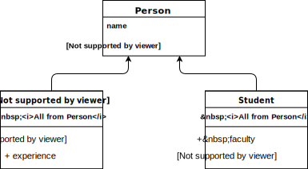
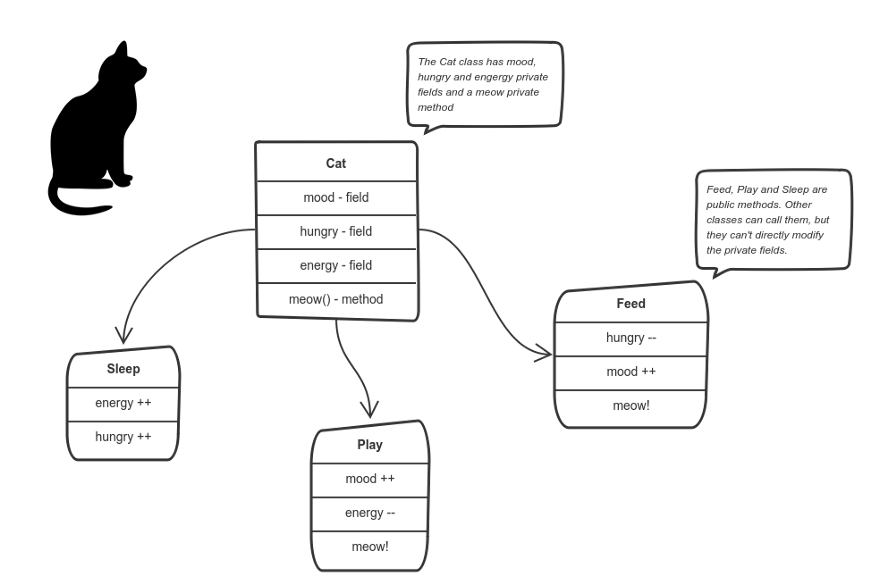
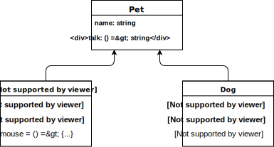
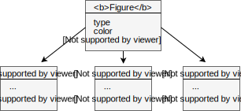

# Введение

Почти всё современное программирование построено на принципах ООП. Это подход к разработке, когда мы описываем происходящее на уровне объектов, которые создаются, меняют свои свойства, взаимодействуют друг с другом и, в случае браузера, со страницей, в общем, живут. Например, «пользователь», «меню», «компонент интерфейса»… 

При объектно-ориентированном подходе каждый объект должен представлять собой интуитивно понятную сущность, у которой есть методы и данные.

Иными словамами, принцип ООП заключается в том, чтобы составлять систему из объектов, решающих простые задачи, которые вместе составляют сложную программу.

> Объектно-ориентированное программирование (ООП) — это шаблон проектирования программного обеспечения, который позволяет решать задачи с точки зрения объектов и их взаимодействий. 

## Принципы ООП

*ООП строится на 4х базовых принципах: наследование, инкапсуляция, абстракция и полиморфизм.*

### Наследование
>Наследование — способность объекта или класса базироваться на другом объекте или классе. Это главный механизм для повторного использования кода.

Наследование позволяет создать новый класс `производный класс` на основе уже существующего `родительский класс`.

Производный класс берет все от родительского, но имеет дополнительные характеристики. Это нужно для того, чтобы просто немного улучшить старый класс, а не создавать новый.

Например у нас есть родительский класс человек `Person`, имеющий имя и возраст, производные от него классы рабочий `Employee`, который будет иметь должность и стаж работы, и студент `Student` с названием факультета и курса.

### Инкапсуляция
>Инкапсуляция включает в себя идею о том, что данные объекта не должны быть напрямую доступны. Нужно вызывать методы вместо прямого доступа к данным. Инкапсуляция позволяет нам скрывать/показывать свойства функций.

Допустим, у нас есть некая программа. У нее есть объекты, которые общаются между собой, в соответствии с правилами, установленными в программе.

Объект самостоятельно управляет своим внутренним состоянием, с помощью методов — и никто другой не может трогать его, если на это нет особого разрешения. Если другой захочет с ним взаимодействовать, ему нужно будет использовать разрешенные методы. Но менять внутреннее состояние нельзя.

Разберем на примере кошки `Cat`, ее поведении и взаимодействия с ней:

Здесь внутренним состоянием кошки являются внутренние переменные: настроение `mood`, голод `hungry` и энергия `energy`. Она также имеет внутренний метод `meow()`. Кошка может вызвать его в любой момент, когда захочет, другие классы не могут говорить кошке, когда ей можно мяукать.

То, что им можно делать, определяется в публичных методах `sleep()`, `play()` и `feed()`. Каждый из них каким-то образом влияет на внутреннее состояние кошки и может вызвать `meow()`. Таким образом, устанавливается связь между внутренним состоянием объекта и публичными методами.
Вот что такое инкапсуляция.

### Абстракция
>Абстракция - это способ создания простой модели, которая содержит только важные свойства с точки зрения контекста приложения, из более сложной модели. Иными словами - это способ скрыть детали реализации и показать пользователям только функциональность. Важно помнить, что мы не можем создать экземпляр абстрактного класса.

В объектно-ориентированном программировании, зачастую, у программ очень большой объем, и объекты много общаются между собой. Как вы понимаете, поддерживать такую кодовую базу в течение долгих лет — с постоянными изменениями — трудно.

Абстракция нацелена на решение этой проблемы.

Применение абстракции означает, что нужно отбросить незначимые характеристики объекта и оставить только значимые.

Предположим, у нас есть домашние питомцы `Pet`, все они должны иметь кличку и уметь подавать голос. Это будет абстрактный класс.

Кошка `Cat` ловит мышей, а собака `Dog` — охраняет и защищает своего хозяина, но у обоих есть все, характерные `Pet`, свойства.

### Полиморфизм
>Полиморфизм — реализация задач одной и той же идеи разными способами.  

Представим, что у нас есть родительский класс фигуры `Figure` со свойствами `type` и `color`, методом `сalcАrea()`, расчитывающий площадь, и несколько экземпляров: треугольник `triangle`, прямоугольник `rectangle`, круг `circle`.

Реализация метода `сalcАrea()` для каждой фигулы должна быть своя.

Эту проблему можно решить, используя полиморфизм.

Можно описать метод `сalcАrea()` у родительского класса таким образом, чтобы он в зависимости от типа фигуры вызывал разные внутренние методы.

Или наследоваться от родительского класса и для каждой фигуры создать новый класс, в котором переопределить функциональность метода для расчета площади.

