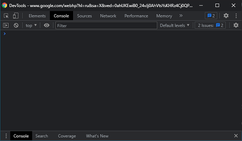

# Консоль
Самый базовый инструмент отладки - это консоль.     
Она предосталяет API для:
* логирования разного уровня сложности и критичности ошибок,
* просмотра текущих значений переменных и состояния выполнения скрипта,
* просмотра результатов выполнения кода.

Чтобы начать работу с консолью достаточно:
1. Запустить браузер,
2. Перейти на интересуюшую страницу,
3. Нажать F12 - откроется отдельное окно инструментов отладки



или они будут встроены прямо в текущую вкладку браузера.


## Выполнение кода
> Консоль - это интерактивный интерпретатор кода. 
> Она в режиме реального времени считывает ввод пользователя, вычисляет что за выражение было введено и выполняет его.
> 

Т.е. используя консоль вы можете выполнять в ней любой написанный код.     

```javascript
function calcSum(maxValue) {
    var sum = 0;
    for (var i = 0; i <= maxValue; ++i) {
        sum += i;
    }
    return sum;
}
calcSum(5);
```
К примеру, если выполнить приведенный код в консоли - будет выведен результат выполнения функции.

Консоль также имеет полный доступ к модификации самой страницы:
```javascript
const div = document.createElement('<div>');
div.id = 'new';
document.body.appendChild(detachedDiv);
```
Приведенный код добавит новый элемент в DOM-дерево. 

Очень удобно, что консоль хранит все вызовы кода и просто движениями стрелок вверх\вниз можно воспроизвести нужный код или найти свой скрипт автодополнением при вводе.


Любое из выведенных в консоль значений можно сохранить в глобальную переменную для проверки.


После выполнения этой операции в консоль будет выведено название созданной переменной.


К примеру, при сохранении экземпляра объекта у вас будет возможность вызывать его методы или просматривать свойства.

В любой момент времени в консоли есть доступ:
1. К глобальным переменным и функциям,
2. К области видимости текущего блока кода, если установлена точка остановки.

## Логирование
Наиболее частые причины для использования консоли это:
1. Проверка порядка выполнения кода,
2. Просмотр текущих значений переменных в момент времени.

Поддерживается несколько уровней логирования:
```javascript
console.log('Инфо');
console.warn('Предупреждение');
console.error('Ошибка');
```
Помимо всего прочего консоль позволяет отфильтровать только необходимый уровень логирования в консоли:  


это поможет быстро найти наиболее критичные ошибки на странице.

Если вам потребуется более четкая структура логирования консоли - всегда есть возможность сгруппировать сообщение по маркеру группы
```javascript
console.group();
```
Очистить консоль можно командой clear:
```javascript
console.clear();
```

> Обратите внимание, что команды работы с консолью в вашем коде могут не всегда работать.

Также логирование можно выводить через специальные точки логирования (logpoints).
Установить их можно непосредственно в исходниках кода в браузере:
1. Необходимо перейти на вкладку Sources,
2. Выбрать нужный файл и строку,
3. Правой кнопкой кликнуть на номер строки - Add logpoint,


4. В появившемся окне можно ввести любое вычисляемое выражение на JS. 
   При попадании в точку кода оно будет вычислено и выведено в консоль.


## Мониторинг
Если требуется отследить вызовы функции без модификации кода - это можно сделать с помощью методов мониторинга.  
На вход в метод требуется передать ссылку на функцию.
```javascript
monitor(calcSum);
calcSum(5);
calcSum(10);
unmonitor(calcSum);
```
В результате каждый вызов будет порождать отдельную запись в консоль названия функции и параметров ее вызова.    


Для DOM-элементов событий есть схожий функционал monitorEvents/unmonitorEvents.
> Нельзя забывать, что подобные мониторинги обязательно нужно осознанно завершать - иначе есть шанс получить утечку памяти.

## Замер времени выполнения
Для первичной оценки быстродействия своего кода можно включить замер времени выполнения кода.   
Для этого достаточно в начале выполнения указать метку для блока кода
```javascript
console.time('sum');
calcSum(100);
console.timeEnd('sum');
```
Такой код выведет время в миллисекундах сколько браузер потратил времени на ввызов функции.

## Watch-выражения
В режиме реального времени в консоли можно отслеживать текущий результат любого выражения в зависимости от состояния программы:


