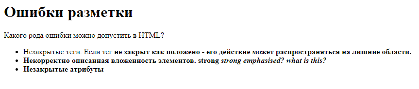
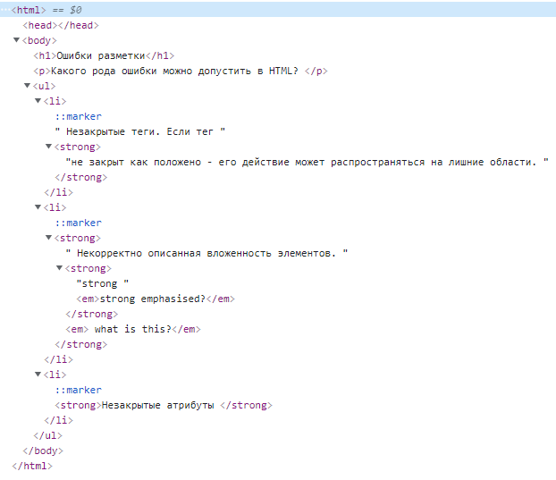
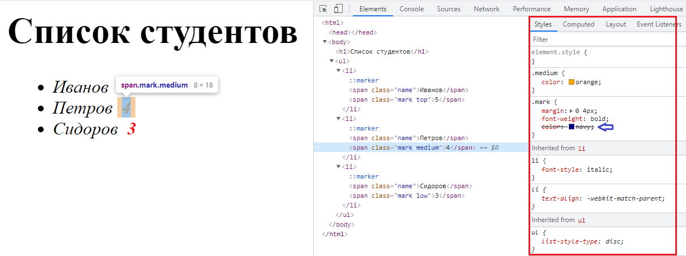
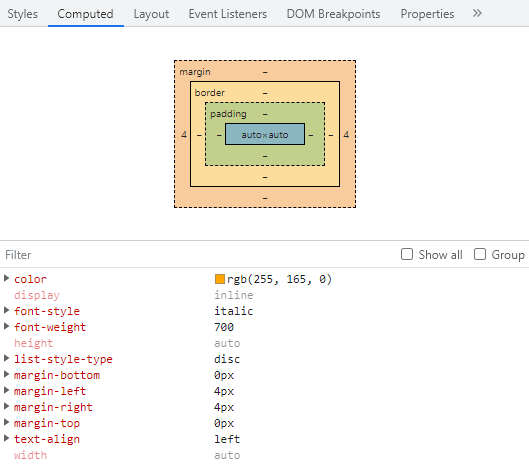
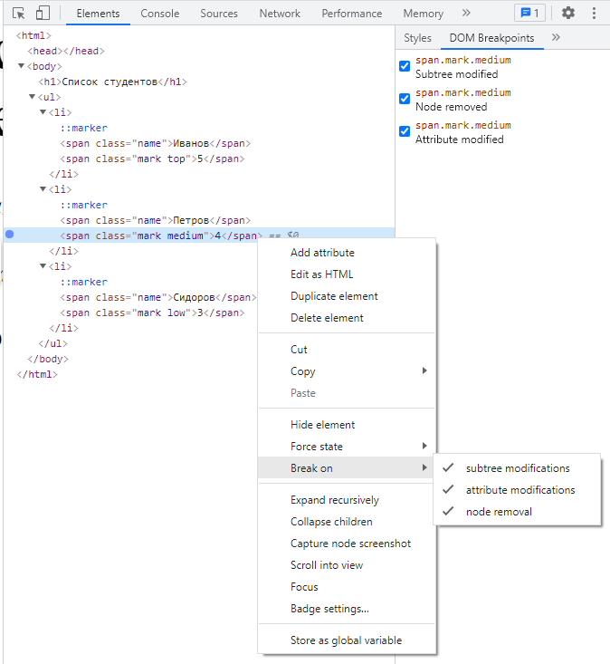
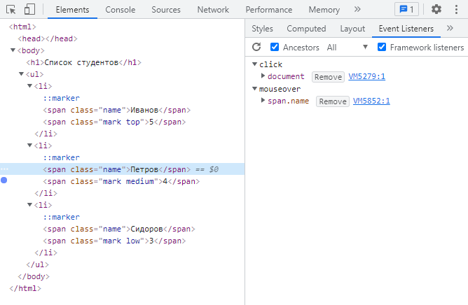

# Отладка HTML и CSS
https://developer.mozilla.org/ru/docs/Learn/HTML/Introduction_to_HTML/Debugging_HTML    

## HTML
Особенность HTML состоит в том, что он не компилируется в другой формат перед отображением браузером (он является интерпретируемым, а не компилируемым).    
Браузеры анализируют и обрабатывают HTML более толерантно, в сравнении с языками программирования, интерпретирующими код строже.    
В это состоит и преимущество, и значительный недостаток.

Когда мы говорим о коде, как правило основной пул ошибок, с которыми сталкивается программист - это:
1. Синтаксические ошибки - ошибки в правильности написания.    
Такие ошибки обычно легко исправить, проанализировав текст исключения.
2. Логические ошибки - ошибки непосредственно в алгоритмах программы.    
   Такие исправлять сложнее, чем синтаксические, поскольку никаких исключений явно не выдается и, как правило, приходится пощагово отлаживать ход выполнения.

HTML не страдает от синтаксических ошибок, потому что браузер читает код толерантно.    
Даже если верстка написана некорректно - браузер все равно отобразит страницу в том или ином виде, поскольку они имеют встроенные правила по интерпретации неверно написанной разметки.

Рассмотрим на примере:
```html
    <h1>Ошибки разметки</h1>
    <p>Какого рода ошибки можно допустить в HTML?
    <ul>
        <li>
            Незакрытые теги. 
            Если тег <strong>не закрыт как положено - его действие может распространяться на лишние области.
        </li>
        <li>
            Некорректно описанная вложенность элементов. 
            <strong>strong <em>strong emphasised?</strong> what is this?</em>
        </li>
        <li>Незакрытые атрибуты <a href="https://www.google.com/>Поиск</a></li>
    </ul>
```

Приведенный код содержит следующий набор проблем:
1. У параграфа и элемента списка не закрыты теги.  
   На изображении выше видно, что разметка не пострадала, так как браузеру легко сделать вывод о том, где заканчивается один элемент и начинается другой.
2. Первый \<strong> элемент также не имеет закрывающего тега.    
   Это уже более проблематично, так как сложно сказать, где элемент должен заканчиваться.
3. Следующая часть нарушает правила вложенности - теги \<strong> и \<em> пересекаются.    
```html
    <strong>strong <em>strong emphasised?</strong> what is this?</em>
```
4. В атрибуте href отсутствует закрывающая двойная кавычка.

Посмотрим что визуально отобразил нам браузер.



Откроем сгенерированный браузером HTML через Chrome DevTools (правой кнопкой мышки кликаем на элемент, нажимаем Inspect) - откроется представление DOM-дерева.



Если сравнить разметку из кода и результат браузера - видно, что разметка не совпадает.
Браузер как смог исправил ошибки в нашей верстке:
1. Добавил закрывающий тег <\p>,
```html
    <p>Какого рода ошибки можно допустить в HTML?</p>
```
2. Поправил некорректную вложенность,
```html
    <p>Какого рода ошибки можно допустить в HTML?</p>
```
3. Вырезал некорректные элементы - тега \<a> в результирущей верстке просто нет.

При этом никаких ошибок в консоли или где-то еще браузер не выдал, поэтому следует *настроить дополнительную проверку верстки на валидность* в своей IDE.

---
Отдельно стоит отметить, что *поведение разных браузеров различается*.   
Методика "исправления" ошибок верстки также может быть разной, поэтому следует проверять верстку и стили во всех целевых браузерах, для которых вы пишете свой код.
---

Несмотря на то, что ошибки верстки бруазером явно не показываются - инструменты отладки весьма и весьма полезны при работе с версткой.

Помимо простого просмотра структуры DOM-дерева в инструментах отладки браузер предоставляет возможность модифицировать состав тегов и стилей на лету без перезагрузки страницы.

Подробнее познакомиться с работой вкладки Elements можно [тут](https://developer.chrome.com/docs/devtools/dom/).


---
## CSS
На примере другого HTML разберемся какие проблемы могут быть с CSS и какие средства дает нам браузер для их решения: 
```html
<h1>Список студентов</h1>
<ul>
    <li>
       <span class="name">Иванов</span>
       <span class="mark">5</span>
    </li>
    <li>
       <span class="name">Петров</span>
       <span class="mark">4</span>
    </li>
    <li>
       <span class="name">Сидоров</span>
       <span class="mark">5</span>
    </li>
</ul>
```
```css
li {
   font-style: italic;
}
.mark {
   margin: 0 4px;
   font-weight: bold;
   color: navy;
}
.top {
   color: green;
}
.medium {
   color: orange;
}
.low {
   color: red;
}
```
Проинспектировав конкретный элемент в браузере - сразу можно увидеть достаточно исчерпывающий обьем информации:
* тип элемента и список примененных классов,
* размеры элемента,
* цветными рамками выделены отступы элемента,
* список примененных стилей,
  * стили, которые перебиты более сильными правилами, перечеркнуты и легко визуально отличимы.
  * все свойства с цветами визуально отображены в палитре.



Что позволяет очень наглядно и легко можно отследить ситуации с неверным приоритетом применения правил на элементы.

>!!!! 
>* редактирование стилей на ходу
>* псевдоклассы
>* добавление новые стилей
>* интерактивные подсказки свойств

Также есть возможность просмотреть набор вычисленных стилей, которые действительно повлияли на отображение элемента на вкладке Computed в компактном виде.



При необходимости в некоторых ситуациях управление набором классов и обработкой событий на элементе переходит в руки JS.   
Доступ к DOM-дереву через стандартное API ничем не ограничен и любой скрипт может получить доступ к элементу.  
Таким образом отследить точку изменения элемента с ростом приложения становится все сложнее.
Для этих целей в инструментах браузера есть возможность:
* устанавливать точки остановки для изменений DOM-дерева,


* просматривать обработчики событий элементов


