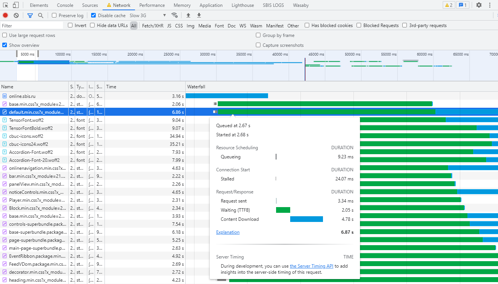

# Быстродействие
Основная цель анализа производительности - улучшить работу для пользователя и ваша задача сделать приложение максимально приятным для него.

**RAIL** - это ориентированная на пользователя модель анализа производительности.    
Она сводится к анализу поведения страницы в ответ на ожидания и действия пользователя.


[Источник](https://web.dev/rail/)

Приведем основные факторы, которые влияют на производительность:
1. Скорость соединения,
2. Аппаратная составляющая,
3. Работа кеша,
4. Парсинг и выполнение JS.

При улучшении производительности вашего приложения важно уделять внимание каждому из этих аспектов.

Средства отладки в Chrome DevTools дают удобный и обширный набор инструментов для выявления проблем по всем этим направлениям.

## Загрузка ресурсов
При первичной загрузке страницы очень критичны загружаемые сразу ресурсы.   
Проанализировать список этих файлов и последовательность их загрузки можно на вкладке Network.  
Для эксперимента вы можете открыть любую интересующую страницу в браузере, открыть инструменты отладки, перейти на вкладку Network и обновить страницу.



> Если зажать клавишу Shift и ховером пройтись по списку загруженных статических файлов - Chrome выкрасит файл-инициатор в красный цвет, а зависимый в зеленый. 

По каждому запросу можно увидеть статистику его обработки по ховеру на диаграмме:
1. Queueing - время ожидания перед обработкой запроса.    
   К примеру, запрос встает в очередь ожидания, если есть более приоритетные запросы. The browser queues requests when:
2. Started - время начала запуска обработки запроса.
3. Stalled - время блокировки запроса на время, пока устанавливается соединение.
4. Request sent - время, когда запрос был отправлен.
5. Waiting (TTFB) - ожидание бразуером первого байта ответа. 
>TTFB - Time To First Byte.
6. Content Download - получение ответа браузером.

По шкале обработки запроса легко можно отследить:
1. Какие запросы тормозили загрузку страницы, а какие отрабатывали асинхронно по точкам начала и конца диаграммы запроса,
2. Зависимые файлы, которые стартуют свою обработку после инициатора.


Чем раньше находится начало шкалы по запросу - тем раньше от был запущен на странице.

См. раздел по загрузке статических файлов через async/defer.


Из базовых рекомендаций:
1. Грузите статические файлы по возможности асинхронно, не затормаживая страницу,
2. Не грузите на своей странице файлы и в целом запросы, которые не нужны сразу, предварительно нужно грузить только самое необходимое.

### Полезные возможности
Из полезного на вкладке Network можно:
1. Сохранение логов - можно настроить сохранение списка запросов при обновлении страницы,
   
2. Отключение кеша - при включенном чекбоксе все статические файлы будут принудительно заново загружены с сервера, а не из кеша браузера,
   
3. Эмуляция отключения связи и замедление скорости соединения,
   
4. Фильтр по типам запросов.
   
5. Сохранение и загрузка HAR-файла - крайне полезная фича.   
   Если необходимо ситуацию по запросам у стороннего пользователя или передать на анализ кому-то свою статистику - можно скачать и загрузить в браузер лог отдельным файлом.
   
## Профилирование производительности
Провести профилирование страницы в Chrome DevTools можно на вкладке Performance.


Если запустить профилирование и обновить страницу, а затем остановить запись профиля - отобразится статистика с распределением на затраченные действия.  

На приведенном профиле видно, что браузер потратил:
* 35 мс на загрузку,
* 2301 мс на выполнение скриптов,
* 45 мс на рендеринг "картинки",
* 11 мс на отрисовку,
* 382 мс на системные действия,
* 906 мс ожидание действий пользователя.

### Параметры профилирования

Если выделить конкретный период времени, который нас интересует, - на шкале выполнения операций будет лучше видно на что было потрачено время.


На примере также хорошо виден стек вызовов функций, можно точно увидеть сколько заняло время отработки каждой функции.

Для понимания как выглядит ваша страница в каждый момент времени загрузки страницы можно включив запись скриншотов.


Также можно включить опцию для просмотра статистики использования памяти в процессе выполнения профиля.


При построении профиля и оценке быстродействия страницы стоит учитывать не только машины с быстрой скоростью соединения и производительностью, но и сценарии с заниженными параметрами.   
Для этого можно настроить замедление прямо в браузере.

Он позволяет смоделировать проблемы с:
1. Скоростью соединения


Для замедления скорости соединения можно использовать не только преднастроенные профили, но и создавать кастомизированные.    
На приведенном скрине профиль Loooow как раз настроен вручную.    
Снижение производительности таким способом позволит наглядно увидеть процесс поэтапной загрузки страницы.

2. CPU 


Снижение производительности процессора наглядно покажет медленный рендреринг и выполнение скриптов.

После проведения профилирования на странице следует найти самые долгие операции на шкале и уже детально анализировать проблемы на конкретном участке.

## Аудит
Chrome позволяет строить автоматизированный отчет производительности по странице в целом:


По результату он выдает оценки в каждой категории:


Но самое главное - он выдает рекомендации по улучшению производительности!


# Базовые проблемы производительности
## Загрузка статики
Минимифицируйте свой код - так вы снижаете объем файлов, которые скачиваются при загрузке вашей страницы.

Кешируйте максимум информации - это позволит в целом ускорить время загрузки статики.

Ленивая загрузка - не загружайте файлы, которые не нужны вам на старте страницы.    
Лучше отложить загрузку до явных действий пользователя.

Используйте по возможности async и defer - не все скрипты вам нужны для первичного отображения страницы.

## Javascript
### Переменные
Минимизируйте количество одинаковых вычислений.     
К примеру, если какие-то значения требуются в нескольких участках кода - лучше сохранить результат в переменную и использовать ее.

К примеру, при прохождении цикла по массиву ```for (let i = 0; i < length; ++i) {``` значение ```list.length``` вычисляется на каждой итерации цикла.   
Даже микрооптимизация с созданием константы может дать маленький, но все-таки прирост производительности:
```javascript
const length = list.length;
for (let i = 0; i < length; ++i) {
  // ...
}
```

### Область видимости
Старайтесь в своем коде работать с локальной областью видимости и не перегружать его замыканиями.
Обращения к глобальной видимости работают медленнее.

### Стандартные методы
По максимуму используйте встроенные методы, а не пишите свои велосипеды.    
Встроенные методы все равно будут работать оптимальнее.

### Циклы
Циклы - неотъемлемая часть почти любого кода, но не всегда циклом стоит проходиться по **всем** элементам массива.  
К примеру, если вы ищете какой-то конкретный элемент - прерывайте цикл сразу же как его найдете.

```javascript
for (let i = 0; i < list.length; ++i) {
  if (isCorrect(list[i])) {
    doStuff();
    break;
  }
}
```

## Работа с DOM
Вся работа с DOM в скриптах - это дорогостоящие операции.   
Поэтому ваша задача минимизировать всю работу с DOM или объединять все действия в одну "транзакцию".

Если вам необходимо вставить в элемент несколько подэлементов один за одним - не делайте это в лоб.

Уменьшайте количество обращений к DOM - даже поиск элемента занимает время.

Например, приведенный код будет работать прилично медленнее
```javascript
console.time('multiple getElementById');
document.getElementById('title').innerHTML = 'John';
document.getElementById('title').className = 'name';
console.timeEnd('multiple getElementById');
```
чем
```javascript
console.time('single getElementById');
const titleElement = document.getElementById('title');
titleElement.innerHTML = 'John';
titleElement.className = 'name';
console.timeEnd('single getElementById');
```


Если требуется добавить элемент в DOM - сначала выполните над ним все манипуляции и только потом добавляйте его
```javascript
console.time('Добавляем элемент, потом модифицируем');
const element1 = document.createElement('div');
document.body.appendChild(element1);
element1.innerHTML = 'John';
element1.className = 'name';
console.timeEnd('Добавляем элемент, потом модифицируем');

console.time('Добавляем уже модифицированный элемент');
const element2 = document.createElement('div');
element2.innerHTML = 'John';
element2.className = 'name';
document.body.appendChild(element2);
console.timeEnd('Добавляем уже модифицированный элемент');
```


### Обработчики событий
Не перегружайте свой код множеством обработчиков событий DOM.   
Если подписываетесь на событие, которое может стрелять много раз подряд - используйте debounce/throttle.
```javascript
function throttle(callback, limit) {
  let wait = false;
  return function () {
    if (!wait) {
      callback.apply(null, arguments);
      wait = true;
      setTimeout(function () {
        wait = false;
      }, limit);
    }
  };
}

function handler(e) {
  console.log(e);
}
const throttledHandler = throttle(handler, 500);
window.addEventListener("resize", throttledHandler);
```
