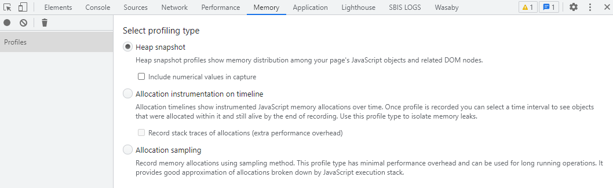
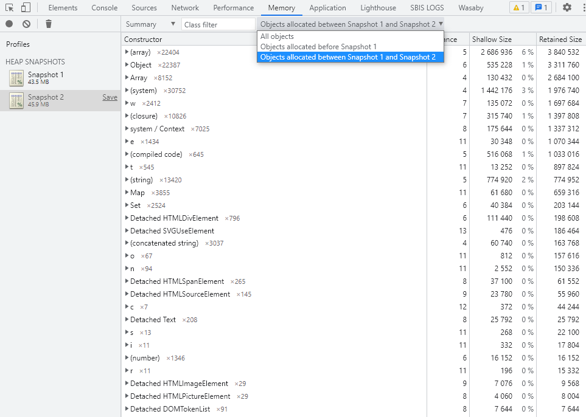
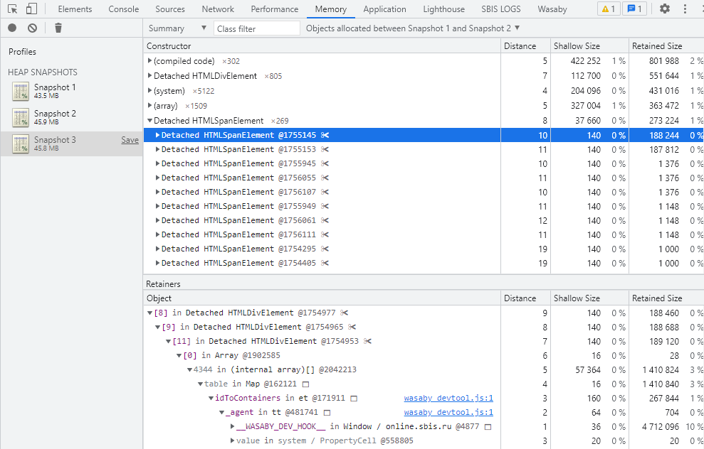

# Утечки памяти
Браузер в ходе работы хранит объекты в памяти, пока они могут быть доступны в скрипте напрямую или по ссылке.      
>Сборщик мусора - это фоновый процесс в движке JavaScript, который определяет недоступные более объекты, удаляет их и вывобождает память.

Утечка памяти происходит, когда объект в памяти, который должен быть очищен сборщиком мусора, остается доступным через непреднамеренную ссылку из другого объекта.     
Хранение избыточных объектов в памяти приводит к избыточному расходу памяти и может привести к снижению производительности.

Утечки памяти - это уже повышенный уровень сложности ошибки, их поиск может занимать значительное время.   
Самое интересное, что сама по себе утечка памяти по сути не является июсключением, поэтому браузер не выдает никаких явных ошибки.

Основное проявление утечки - снижение производительности страницы производительность нашей страницы постепенно ухудшается и в итоге может произойти краш страницы.

## Примеры утечек
Рассмотрим базовые причины возникновения утечек памяти.

### Случайные глобальные переменные
Глобальные переменные всегда доступны из корня скрипта и никогда не будут очищены сборщиком мусора.      
Некоторые ошибки вызывают утечку переменных из локальной области в глобальную область в нестрогом режиме:
* присвоение значения необъявленной переменной,
* использование ключевого слова this, которое указывает на глобальный объект.
```javascript
function createGlobalVariables() {
    memoryLeak1 = 'Утечка памяти №1';
    this.memoryLeak2 = 'Утечка памяти №2';
}
createGlobalVariables();
console.log(memoryLeak1, memoryLeak2);
```
Ошибки такого рода исключаются использованием строгого режима ```'use strict'```.
С ним приведенный код выдаст ошибку, потому что переменные не объявлены явно.

### Замыкания
Переменные в локальной области любой функции будут очищены после того, как функция вышла из стека вызовов, и если за пределами функции не осталось ссылок, указывающих на них.    
Замыкание будет поддерживать переменные, на которые имеются ссылки, и живые, хотя функция завершила выполнение, а ее контекст выполнения и переменная среда давно исчезли.

```javascript
function addMessage() {
    const hugeArray = [];
    return function add() {
        hugeArray.push('Message');
    }
}

function repeat(fn, count) {
    for (var i = 0; i < count; ++i) {
        fn();
    }
}

const doAdd = addMessage();
repeat(doAdd, 1000);

```
В этом примере массив potentiallyHugeArray никогда не возвращается ни из одной из функций, поэтому и не может быть получен, тем не менее его размер может бесконечно увеличиваться в зависимости от того, сколько раз мы вызываем функцию inner(). Т.е. такое обращение с переменной внутри многократно вызываемой функции не приводит к каким-либо результатам, зато сильно нагружает память.

Как это предотвратить: замыкания являются неизбежной и неотъемлемой частью JavaScript, поэтому важно:
* понять, когда замыкание было создано и какие объекты оно удерживает,
* понять ожидаемую продолжительность жизни и использования замыкания (особенно если такая функция используется в качестве обратного вызова - callback-функции).

### Таймеры
Наличие setTimeout или setInterval, ссылающихся на некоторый объект в функции обратного вызова, является наиболее распространенным способом предотвращения сборки мусора.   
Если мы установим повторяющийся таймер в нашем коде (мы можем заставить setTimeout вести себя как setInterval, т.е. сделать его рекурсивным), тогда ссылка на объект из обратного вызова таймера будет оставаться активной до тех пор, пока обратный вызов будет существовать.

В приведенном ниже примере объект данных может быть собран мусором только после очистки таймера. Поскольку у нас нет ссылки на setInterval, его нельзя очистить, а data.hugeString сохраняется в памяти до тех пор, пока приложение не остановится, хотя никогда не используется.
```javascript
function setCallback() {
    const data = {
        counter: 0,
        hugeString: new Array(1000).join('+')
    };
    return function cb() {
        data.counter++;
    }
}
setInterval(setCallback(), 1000);
```
Как это предотвратить: особенно если продолжительность жизни функции обратного вызова не определена или неопределенна:
* быть осведомленным об объектах, на которые ссылается обратный вызов таймера,
* используя дескриптор, связанный с таймером, отменить вызов таймера (интервала) методом clearTimeout()  (clearInterval()) при необходимости.

```javascript
const intervalId = setInterval(setCallback(), 1000);
// ...
clearInterval(intervalId);
```
### Подписчики на события
Активный слушатель событий, добавленный с помощью метода addEventListener(), предотвратит сбор мусора всех переменных, существующих в его области.   
После однократного добавления слушатель событий будет действовать до тех пор, пока:

не будет явно удален с помощью метода removeEventListener()
связанный со слушателем события элемент DOM будет удален.
Для некоторых типов событий ожидается, что они будут сохраняться до тех пор, пока пользователь не покинет страницу, например, для кнопок, которые должны нажиматься несколько раз. Однако иногда мы хотим, чтобы слушатель событий выполнялся определенное количество раз.
```javascript
class Subscriber {
    constructor() {
        document.addEventListener('click', () => {
           console.log('Я прослушал событие'); 
        });
    }
}

let subscriber1 = new Subscriber();
subscriber1 = null;
```
Со временем сборщик мусора вроде как должен очистить все упоминания экземпляра Subscriber, но подписка на событие document никуда не денется.
Поэтому при избавлении от объекта необходимо вызвать отписку.
```javascript
class Subscriber {
    constructor() {
        this._clickHandler = () => {
            console.log('Я прослушал событие');
        };
        document.addEventListener('click', this,_clickHandler);
    }
    
    destroy() {
        document.removeEventListener('click', this._clickHandler);
    }
}

let subscriber1 = new Subscriber();
subscriber1.destroy();
subscriber1 = null;
```

### Detached элементы
Если узел DOM имеет прямые ссылки из JavaScript - сборщик мусора не сможет удалить элемент из памяти.

```javascript
function createElement() {
    const div = document.createElement('<div>');
    div.id = 'detached';
    return div;
}

const detachedDiv = createElement();
document.body.appendChild(detachedDiv);
document.body.removeChild(document.getElementById('detached'));
```

Как это предотвратить? Одним из возможных решений является перемещение ссылок DOM в локальную область функции.   
В приведенном ниже примере переменная, указывающая на элемент DOM, удаляется после завершения функции appendElement()

```javascript
function createElement() {
    //...
}
function appendElement() {
    const detachedDiv = createElement();
    document.body.appendChild(detachedDiv);
}
document.body.removeChild(document.getElementById('detached'));
```

## Как искать утечки памяти
Под инструменты поиска утечек памяти в Chrome DevTools выделена отдельная вкладка Memory.



Поскольку сборщик мусора работает в фоне - иногда требуется ручной запуск, его можно произвести по кнопке с мусорным ведром в левой части. 

Для отладки утечки памяти требуется локализовать хотя бы примерный сценарий, когда происходит ощутимый провал производительности страницы.  
Проще всего локализовать подобный сценарий можно простым повторением одних и тех же действий большое количество раз.
Какой бы тип профилирования вы не выбрали - базовый сценарий поиска утечки остается таким же.

Подробнее мы рассмотрим Heap snapshot и Allocation timeline.

> Важно: для более точного поиска утечки рекомендуется работать в режиме Инкогнито.

### Heap snapshot
Heap snapshot представляет собой снятие "слепка" текущих объектов, хранящихся в памяти.

Для того чтобы отследить накапливаемые объекты - требуется делать несколько последовательных снимков.

Если ваш сценарий предполагает загрузку каких-то статических файлов - предварительно стоит загрузить их с сервера.

Далее:
1. Первый снимок делаем без воспроизведения сценария,
2. Затем второй снимой делаем уже после вопроизведения предположительного сценария,
3. Сравниваем состояние памяти по зафиксированным снимкам.



>**Shallow size** - это объем памяти, удерживаемой под сам объект.  
>**Retained size** - это объем памяти, который высвободится, если удалить объект и его связанные объекты, которые больше ниоткуда недоступны.

Чем больше Retained size объекта - тем критичнее его сохранность в памяти.  

Для каждой в списке созданных обьектов можно просмотреть его "источник" - по нему и следует анализировать точку возникновения утечки.



### Allocation Timeline
В случае работы с Allocation Timeline анализ утечек памяти идет по временной шкале.     
Вы запускаете запись таймлайна и начинаете повторять предположительный сценарий снова и снова.      
Созданные в ходе работы объекты отображаются в виде синих столбиков, чем выше столбик - тем больше памяти было ихрасходовано.       
Со временем запускается сборщик мусора и объекты, созданные на предыдущих воспроизведениях сценария должны исчезать.    
Если какая-то часть объектов не исчезает - вероятно в этом месте и есть утечка памяти.


