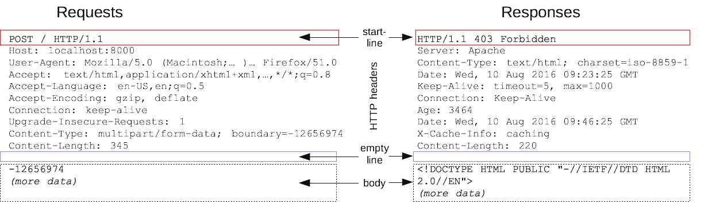

# HTTP

HTTP - Hypertext Transfer Protocol (Протокол передачи гипертекста) - это прикладной протокол для передачи гипертекстовых документов, таких как HTML. Протокол HTTP лежит в основе обмена данными в Интернете. HTTP является протоколом клиент-серверного взаимодействия, что означает инициирование запросов к серверу самим получателем, обычно веб-браузером.

Обмен данными между клиентом и сервером происходит с помощью HTTP сообщений. Сообщения HTTP состоят из текстовой информации в кодировке ASCII, записанной в несколько строк.  
В HTTP/1.1 и более ранних версиях они пересылаются в качестве обычного текста.  
В HTTP/2 текстовое сообщение разделяется на фреймы, что позволяет выполнить оптимизацию и повысить производительность.

Есть два типа HTTP сообщений:  
* **запросы**, отправляются клиентом
* **ответы**, отправляются от сервера.

HTTP запросы и ответы имеют близкую структуру. Они состоят из:

1. Стартовой строки, описывающей запрос, или статус (успех или сбой). Это всегда одна строка.
2. Произвольного набора HTTP заголовков, определяющих запрос или описывающих тело сообщения.
3. Пустой строки, указывающей, что вся мета информация отправлена.
4. Произвольного тела, содержащего пересылаемые с запросом данные (например, содержимое HTML-формы ) или отправляемый в ответ документ. Наличие тела и его размер определяется стартовой строкой и заголовками HTTP.



## HTTP запрос

### Стартовая строка

Состоит из трёх элементов:

* [Метод HTTP](./2-HttpMethods.md). Методов много, основные - GET, HEAD, POST и PUT. Например, GET указывает, что нужно получить некоторый ресурс, а POST означает отправку данных на сервер.
* Путь запроса. Обычно URL, или абсолютный путь протокола, порт и домен обычно характеризуются контекстом запроса.
* Версия HTTP, определяющая структуру оставшегося сообщения, указывая, какую версию предполагается использовать для ответа.

```
   GET /anypage HTTP/1.1
```

### Заголовки запроса

Структура HTTP заголовка: не зависящая от регистра строка, завершаемая двоеточием и значение. Весь заголовок, включая значение, представляет собой одну строку.

```
   content-type: text/html; charset=UTF-8
```

Бывают заголовки, характерные только для запроса, например, User-Agent.

Побробнее про HTTP заголовки можно посмотреть [тут](https://developer.mozilla.org/ru/docs/Web/HTTP/Headers)

### Тело

Тело бывает не у всех запросов: запросы, собирающие ресурсы, такие как GET, HEAD, DELETE, или OPTIONS, в нем обычно не нуждаются. Но некоторые запросы отправляют на сервер данные для обновления, как это часто бывает с запросами POST.

## HTTP ответ

### Стартовая строка

Стартовая строка состоит из трёх элементов:

* Версию протокола, например HTTP/1.1.
* Код состояния ([status code](https://developer.mozilla.org/ru/docs/Web/HTTP/Status)), показывающая, был ли запрос успешным.
* Пояснение. Краткое текстовое описание кода состояния, помогающее пользователю понять сообщение HTTP.

```
   HTTP/1.1 404 Not Found
```

### Заголовки ответ

Тоже что и у HTTP запроса.

Бывают заголовки, характерные только для ответа, уведомляющие клиент о некоторых возможностях сервера, например, Accept-Ranges.

### Тело

Тело есть не у всех ответов: у ответов с кодом состояния, например, 201 или 204, оно обычно отсутствует.